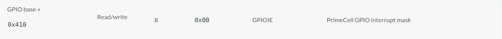

## pl061（GPIO）模块驱动编写

上一节我们已经对`tock-registers`有了基础的了解，恰好实验六终于是有点意思，开始让我们自己写驱动了。

所以在这节我们将做一个示例，讲述我们该如何去描述一个硬件的驱动。

### pl061（GPIO）基本知识

GPIO`（General-purpose input/output）`，通用型之输入输出的简称，功能类似8051的`P0—P3`，其接脚可以供使用者由程控自由使用，PIN脚依现实考量可作为通用输入（GPI）或通用输出（GPO）或通用输入与输出（GPIO），如当`clk generator`, `chip select`等。

既然一个引脚可以用于输入、输出或其他特殊功能，那么一定有寄存器用来选择这些功能。对于输入，一定可以通过读取某个寄存器来确定引脚电位的高低；对于输出，一定可以通过写入某个寄存器来让这个引脚输出高电位或者低电位；对于其他特殊功能，则有另外的寄存器来控制它们。

而在此实验中，我们用的`arm`架构的GPIO文档在此：[ARM PrimeCell General Purpose Input/Output (PL061) Technical Reference Manual](https://developer.arm.com/documentation/ddi0190/b)

### virt机器关机原理

查看设备树：

```vts
gpio-keys {
        #address-cells = <0x01>;
        #size-cells = <0x00>;
        compatible = "gpio-keys";

        poweroff {
                gpios = <0x8003 0x03 0x00>;
                linux,code = <0x74>;
                label = "GPIO Key Poweroff";
        };
};
```


可以看到，关机键接入到了GPIO处理芯片的三号输入口（设备树上的反映在`gpio-keys`的`poweroff["gpios"]`第二个参数反映。当外部输入关机指令时，三号线将产生一次信号并发生一次中断。让我们记住这一点，这是实现关机功能的关键。

### 驱动编写实例

由于我们只需要实现关机功能，所以这里我们也并不定义额外的寄存器。之所以我在这里称之为一个示例，是因为我们并没有完整的实现它。

当我们向`GPIO`中输入关机指令时，`GPIORIS`（中断状态寄存器`PrimeCell GPIO raw interrupt status`）中的第三位将从`0`跳变到`1`。而当`GPIOIE`（中断掩码寄存器`PrimeCell GPIO interrupt mask`）中的第三位为`1`时，GPIO处理芯片将向GIC中断控制器发送一次中断，中断号为`39`。而我们受到中断后，需要丢此次GPIO中断进行清除，将`GPIOIC`（中断清除寄存器`PrimeCell GPIO interrupt clear`）的对应位置为`1`，然后进行关机操作。

另外在设备树文件中，关于GPIO的设备描述如下：

```vts
pl061@9030000 {
        phandle = <0x8003>;
        clock-names = "apb_pclk";
        clocks = <0x8000>;
        interrupts = <0x00 0x07 0x04>;
        gpio-controller;
        #gpio-cells = <0x02>;
        compatible = "arm,pl061\0arm,primecell";
        reg = <0x00 0x9030000 0x00 0x1000>;
};
```

可以看到GPIO设备的内存映射起始地址是`0x09030000`。

由于`GPIORIS`是一个只读寄存器，而我们知道一旦关机该寄存器的值将变为`0b00001000`（三号线产生的中断），在此我们并不需要将其在代码中体现。因此，我们在本节实验中，只需要定义`GPIOIE`和`GPIOIC`两个寄存器。

现在我们开始动手写驱动了，新建`src/pl061.rs`，先写入一个基本的模板。

```rust
use tock_registers::{registers::{ReadWrite, WriteOnly, ReadOnly}, register_bitfields, register_structs};

// 寄存器基址定义
pub const PL061REGS: *mut PL061Regs = (0x0903_0000) as *mut PL061Regs;

// 寄存器位级描述
register_bitfields! [
    u32,
];

// 寄存器结构定义和映射描述
register_structs! {
    pub PL061Regs {
    }
}
```

我们自顶向下，从**寄存器结构定义和映射**开始，在到**寄存器位级细节**进行对应的定义：

#### 寄存器基本结构描述

首先是两个寄存器的定义，我们查看GPIO的寄存器表：[Summary of PrimeCell GPIO registers](https://developer.arm.com/documentation/ddi0190/b/programmer-s-model/summary-of-primecell-gpio-registers)，找到我们需要的两个寄存器信息：




需要记下的是两个寄存器的基址和读写类型，我们可以作如下基本的定义：

```rust
// 寄存器结构定义和映射描述
register_structs! {
    pub PL061Regs {
        (0x410 => pub ie: ReadWrite<u32>),
        (0x41c => pub ic: WriteOnly<u32>),
    }
}
```

而`tock-registers`对寄存器结构定义有如下的要求，我用加粗标识出我们需要注意的部分：

> 寄存器的定义是通过`register_structs`宏完成的，该宏要求每个寄存器有一个偏移量、一个字段名和一个类型。寄存器必须按**偏移量的递增顺序**和**连续顺序**声明。定义寄存器时，必须使用偏移量和**间隙标识符（按照惯例，使用名为_reservedN的字段）显式注释间隙**，但不使用类型。然后，宏将自动计算间隙大小并插入合适的填充结构。结构的**末尾用大小和@end关键字标记**，有效地指向寄存器列表后面的偏移量。

寄存器基址从`0x000`开始，故我们填入空缺，并在最后一个寄存器的下一个地址填入`@end`标记：

```rust
// 寄存器结构定义和映射描述
register_structs! {
    pub PL061Regs {
        (0x000 => __reserved_0),
        (0x410 => pub ie: ReadWrite<u32>),
        (0x414 => __reserved_1),
        (0x41c => pub ic: WriteOnly<u32>),
        (0x420 => @END),
    }
}
```

#### 寄存器位级细节

首先是`GPIOIE`寄存器的细节定义，我们查看该寄存器的细节：[Interrupt mask register, GPIOIE](https://developer.arm.com/documentation/ddi0190/b/programmer-s-model/register-descriptions/interrupt-mask-register--gpioie)

可以知道每位的值即为对应输入输出线的中断掩码。例如第3号位（0开始）的中断启用，则应设置第三位的值为`1`。我们在`register_bitfields!`宏中写入我们需要的第三号位具体描述：

```rust
// 寄存器位级描述
register_bitfields![
    u32,
    
    // PrimeCell GPIO interrupt mask
    pub GPIOIE [
        IO3 OFFSET(3) NUMBITS(1) [
            Disabled = 0,
            Enabled = 1
        ]
    ],
];
```

> 这里的`IO3`只是对三号位的一个命名，`OFFSET`偏移参数指明该位为第三号位，`NUMBITS`指明该位功能共有1位。你在其它的定义中可能会见到以两位甚至更多来存储对应信息。
> 
> `IO3`下的键值更像是一种标识，定义后变可以以更方便的方式对寄存器进行读写。左边的命名是对右边赋值的解释。我们之后在解释时，不需要去记忆某一个位中赋值多少是什么功能，而可以通过命名去做精准的调用。例如[官方文档示例](https://github.com/tock/tock/blob/master/libraries/tock-register-interface/README.md)中：
>
> ```rust
> Control [
> RANGE OFFSET(4) NUMBITS(2) [
>     // Each of these defines a name for a value that the bitfield can be
>     // written with or matched against. Note that this set is not exclusive--
>     // the field can still be written with arbitrary constants.
>     VeryHigh = 0,
>     High = 1,
>     Low = 2
> ]]
> ```
>
> 我们在对`Control`寄存器的[4:6]号位赋值低电平时，只需要使用`xx::Control.write(xx::Control::Low)`，而无需记忆低电平是`0`还是`2`

然后我们需要将寄存器结构描述中的寄存器与其细节联系起来，修改`register_structs!`宏中的`0X410`一行：

```diff
-         (0x410 => pub ie: ReadWrite<u32>),
+         (0x410 => pub ie: ReadWrite<u32, GPIOIE::Register>),
```

发生中断时，回调处理中`GPIOIC`寄存器的值我们可以直接写入`GPIOIE`来描述，这里对不对其进行细节描述并不重要。当然对其具体定义也不会有太大的问题。

而在模板开头我们引入了类型`READONLY`，而我们定义完寄存器后并没有使用它，因此删除这个引用。

```diff
- use tock_registers::{registers::{ReadWrite, WriteOnly, ReadOnly}, register_bitfields, register_structs};
+ use tock_registers::{registers::{ReadWrite, WriteOnly}, register_bitfields, register_structs};
```

最后记得向`src/main.rs`中引入驱动：`mod pl061;`，最终的`pl061`模块驱动如下：

```rust
use tock_registers::{registers::{ReadWrite, WriteOnly}, register_bitfields, register_structs};

// 寄存器结构定义和映射描述
pub const PL061REGS: *mut PL061Regs = (0x0903_0000) as *mut PL061Regs;

// 寄存器位级描述
register_bitfields![
    u32,
    
    // PrimeCell GPIO interrupt mask
    pub GPIOIE [
        IO3 OFFSET(3) NUMBITS(1) [
            Disabled = 0,
            Enabled = 1
        ]
    ],
];

// 寄存器结构定义和映射描述
register_structs! {
    pub PL061Regs {
        (0x000 => __reserved_0),
        (0x410 => pub ie: ReadWrite<u32, GPIOIE::Register>),
        (0x414 => __reserved_1),
        (0x41c => pub ic: WriteOnly<u32>),
        (0x420 => @END),
    }
}
```

个人也写了个较为完整的驱动（gpiodata那个描述可能有些问题），可以查看[https://github.com/2X-ercha/blogOS-armV8/blob/lab6/src/pl061_all.rs](https://github.com/2X-ercha/blogOS-armV8/blob/lab6/src/pl061_all.rs)