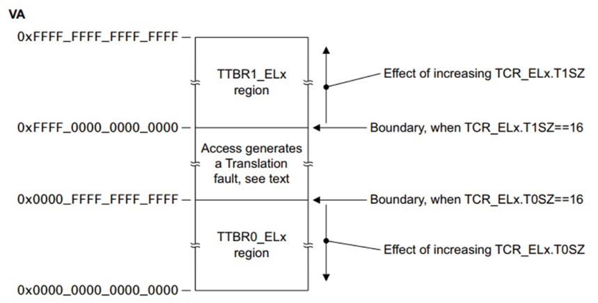

### 使用identity mapping映射（无偏移的映射）

虚拟地址的转换很容易出错也很难调试，所以我们从最简单方式开始，即`identity mapping`，所谓`identity mapping`就是将虚拟地址映射到相同的物理地址。

首先要明确的是，我们内核和外设的物理地址，是不会随着我们改变内核文件就更改地址的（这由机器硬件设备决定）。我们所有的内核内存修改，均修改的是虚拟内存。

我们首先需要了解的是`qemu`模拟的`virt`机器：（以下引自清华rcore的实验指导书：[《rCore-Tutorial-Book 第三版》第一章：应用程序与基本执行环境 » 内核第一条指令（原理篇）](https://rcore-os.github.io/rCore-Tutorial-Book-v3/chapter1/3first-instruction-in-kernel1.html)）

> virt 平台上，物理内存的起始物理地址为 0x80000000 ，物理内存的默认大小为 128MiB ，它可以通过 -m 选项进行配置。在本书中，我们只会用到最低的 8MiB 物理内存，对应的物理地址区间为 [0x80000000,0x80800000) 。
>
> 为什么加载到这两个位置呢？这与 Qemu 模拟计算机加电启动后的运行流程有关。一般来说，计算机加电之后的启动流程可以分成若干个阶段，每个阶段均由一层软件负责，每一层软件的功能是进行它应当承担的初始化工作，并在此之后跳转到下一层软件的入口地址，也就是将计算机的控制权移交给了下一层软件。Qemu 模拟的启动流程则可以分为三个阶段：第一个阶段由固化在 Qemu 内的一小段汇编程序负责；第二个阶段由 bootloader 负责；第三个阶段则由内核镜像负责。
>
> * 第一阶段：将必要的文件载入到 Qemu 物理内存之后，Qemu CPU 的程序计数器（PC, Program Counter）会被初始化为 0x1000 ，因此 Qemu 实际执行的第一条指令位于物理地址 0x1000 ，接下来它将执行寥寥数条指令并跳转到物理地址 0x80000000 对应的指令处并进入第二阶段。从后面的调试过程可以看出，该地址 0x80000000 被固化在 Qemu 中，作为 Qemu 的使用者，我们在不触及 Qemu 源代码的情况下无法进行更改。
>
> * 第二阶段：由于 Qemu 的第一阶段固定跳转到 0x80000000 ，我们需要将负责第二阶段的 bootloader rustsbi-qemu.bin 放在以物理地址 0x80000000 开头的物理内存中，这样就能保证 0x80000000 处正好保存 bootloader 的第一条指令。在这一阶段，bootloader 负责对计算机进行一些初始化工作，并跳转到下一阶段软件的入口，在 Qemu 上即可实现将计算机控制权移交给我们的内核镜像 os.bin 。这里需要注意的是，对于不同的 bootloader 而言，下一阶段软件的入口不一定相同，而且获取这一信息的方式和时间点也不同：入口地址可能是一个预先约定好的固定的值，也有可能是在 bootloader 运行期间才动态获取到的值。我们选用的 RustSBI 则是将下一阶段的入口地址预先约定为固定的 0x80200000 ，在 RustSBI 的初始化工作完成之后，它会跳转到该地址并将计算机控制权移交给下一阶段的软件——也即我们的内核镜像。
>
> * 第三阶段：为了正确地和上一阶段的 RustSBI 对接，我们需要保证内核的第一条指令位于物理地址 0x80200000 处。为此，我们需要将内核镜像预先加载到 Qemu 物理内存以地址 0x80200000 开头的区域上。一旦 CPU 开始执行内核的第一条指令，证明计算机的控制权已经被移交给我们的内核，也就达到了本节的目标。

但这里是针对清华rcore进行的说明，我们的blogos是没有bootloader阶段的。在我们之前的实验中，我们是直接依靠链接脚本，将内核入口指定为`start.s`中的`_start`函数。链接脚本中重新调整了内核的内存布局，内核程序被放置于内存位置`0x40080000`处。

理解上述内容有助于更好理解对内存管理下半节页表映射的实验内容，现在我们可以开始了解一点新的知识了。（其实这部分算是对实验一的补课）

#### Armv8的地址转换

Armv8架构中存在着几个页表基址寄存器：

[ARM Cortex-A Series Programmer's Guide for ARMv8-A](https://developer.arm.com/documentation/den0024/a/The-Memory-Management-Unit/Context-switching) 中提到：TTBR0指向整个虚拟空间下半部分通常用于应用程序的空间，TTBR1指向虚拟空间的上半部分通常用于内核的空间。其中TTBR0除了在EL1中存在外，也在EL2 and EL3中存在，但TTBR1只在EL1中存在。

`TTBR0_ELn`和`TTBR1_ELn`是页表基地址寄存器，地址转换的过程如下所示。


在只涉及一级查找的简单地址转换中。它假设我们使用的是具有`42位`虚拟地址的`64KB`粒度。MMU将虚拟地址转换如下：

* 如果`VA[63:42] == 1`，第一页表的基址则使用TTBR1。当`VA[63:42] == 0`时，第一页表的基址则使用TTBR0。

* 页表包含8192个64位页表条目，并使用`VA[41:29]`编制索引。MMU从表中读取相关的2级页面表条目。

MMU检查页表条目的有效性，以及是否允许请求的内存访问。假设它有效，则允许内存访问。

在上图中，页表条目指的是512MB页（它是块描述符）。

位`[47:29]`取自此页表条目，并形成物理地址的位`[47:29]`。

因为我们有一个 512MB 的页面，所以VA的位`[28:0]`被用来形成`PA[28:0]`。请参见颗粒大小对转换表的影响

最后返回完整的PA[47:0]，以及来自页面表条目的附加信息。

实际上，这样一个简单的转换过程严重限制了地址空间的划分。第一级表条目也可以指向第二级页表，而不是仅使用此第一级转换表。

同时这里还应该知道的是虚拟地址空间各自应该由哪个寄存器管理。arm文档中有一句标准的描述（翻译）：

> 高位是1的虚拟地址空间，使用TTBR1_ELx基地址寄存器进行页表翻译；高位是0的虚拟地址空间，使用TTBR0_ELx基地址寄存器页表翻译。 所以不应该说，因为你使用了哪个寄存器(TTBR0/TTBR1)，然后决定了你使用的哪套虚拟地址空间；应该说，你操作系统(或软件)使用了哪套虚拟地址空间，决定了使用哪个哪个基地址寄存器(TTBR0/TTBR1)进行翻译。



同时我们还需要了解 armv8 的内存管理单元：`Memory Management Unit`，其转换控制寄存器`TCR_ELn`定义了地址如何被转换，内存属性间接寄存器`MAIR_ELn`的作用是预先定义好属性，然后通过索引来访问这些预定义的属性。

TCR寄存器需要配置如下：

| 比特位 | 长度 | 说明 |
| - | - | - |
| IPS | 3 [34:32] | 告诉mmu，你需要给我输出多少位的物理地址 |
| TG1 | 2 [31:30] | 页面大小，4k/16k/64k |
| SH1 | 2 [29:28] | shareable属性，cache的共享属性配置，如 non-shareable/outer-shareable/inner-shareable |
| ORGN1 | 2 [27:26] | cacheable属性，用于定义outer cableability的属性（直写模式、回写模式等） |
| IRGN1 | 2 [25:24] | cacheable属性，用于定义inner cableability的属性（直写模式、回写模式等） |
| EPD1 | 1 [23] | TTBRn_EL1 是否启用 |
| A1 | 1 [22] | ASID的选择，是使用 TTBRN_EL1 中的配置还是 TTBRn_EL0 中的
| T1SZ | 6 [21:16] | top addr 是ignore，还是用于 MTE 的计算，即定义地址空间大小 |
| TG0 | 2 [15:14] | 页面大小，4k/16k/64k |
| SH0 | 2 [13:12] | shareable属性，cache的共享属性配置，如 non-shareable/outer-shareable/inner-shareable |
| ORGN0 | 2 [11:10] | cacheable属性，用于定义outer cableability的属性（直写模式、回写模式等） |
| IRGN0 | 2 [9:8] | cacheable属性，用于定义inner cableability的属性（直写模式、回写模式等） |
| EPD0 | 1 [7] | TTBRn_EL0 是否启用 |
| 0 | 1 [6] | |
| T0SZ | 6 [5:0] | top addr 是ignore，还是用于 MTE 的计算，即定义地址空间大小 |

我们这里在`src/start.s`定义该寄存器值如下：

```assembly
.equ TCR_EL1_VALUE, 0x1B55C351C
```

具体说明如下：

| 比特位 | 值 | 说明 |
| - | - | - |
| IPS   | b001    << 32 | 36bits address space - 64GB |
| TG1   | b10     << 30 | 4KB granule size for TTBR1_EL1 |
| SH1   | b11     << 28 | 页表所在memory: Inner shareable |
| ORGN1 | b01     << 26 | 页表所在memory: Normal, Outer Wr.Back Rd.alloc Wr.alloc Cacheble |
| IRGN1 | b01     << 24 | 页表所在memory: Normal, Inner Wr.Back Rd.alloc Wr.alloc Cacheble |
| EPD1   | b0      << 23 | Perform translation table walk using TTBR1_EL1 |
| A1    | b1      << 22 | TTBR1_EL1.ASID defined the ASID |
| T1SZ  | b011100 << 16 | Memory region 2^(64-28) -> 0xffffffexxxxxxxxx |
| TG0   | b00     << 14 | 4KB granule size |
| SH0   | b11     << 12 | 页表所在memory: Inner Sharebale |
| ORGN0 | b01     << 10 | 页表所在memory: Normal, Outer Wr.Back Rd.alloc Wr.alloc Cacheble |
| IRGN0 | b01     << 8  | 页表所在memory: Normal, Inner Wr.Back Rd.alloc Wr.alloc Cacheble |
| EPD0  | b0      << 7  | Perform translation table walk using TTBR0_EL1 |
| 0     | b0      << 6  | Zero field (reserve) |
| T0SZ  | b011100 << 0  | Memory region 2^(64-28) |

MAIR 支持定义八种预设的内存属性，可以分类为 memory 类型和 device 类型；

每一种类型还包含了一些细节的控制；

对于 memory 类型的内存，主要进行一些cache的分配策略的配置 如write back、write throug等

device 类型是不可cache的地址空间，主要用于对外设寄存器访问等

主要包含了3种属性 G/R/E;

G 表示 Gathering，即是否允许访问合并，比如2个8bit的地址连续的访问请求、合并成为一个16bit的访问请求

R 表示 Re-ordering，即表示对地址空间的访问请求是否支持重新排序，如分别读取2个地址的数据，在访问时顺序可能与程序定义不完全一致

E 表示 Early Write Acknowledgement，即对总线发起写操作时，是否允许总线提前返回写响应，而不需要等待写数据真的写入到了最终的位置。在总线上可能会存在并经过多个节点，提前返回可以提前完成写数据指令的执行。

这里我们在`src/start.s`配置MAIR寄存器值如下：

```assembly
.equ MAIR_EL1_VALUE, 0xFF440C0400
```

说明如下：

| | INDX | MAIR |
| - | - | - |
| DEVICE_nGnRnE | b000(0) | b00000000 |
| DEVICE_nGnRE | b001(1) | b00000100 |
| DEVICE_GRE | b010(2) | b00001100 |
| NORMAL_NC | b011(3) | b01000100 |
| NORMAL | b100(4) | b11111111 |

最后我们在mmu中设置这两个寄存器：

编辑`src/start.s`：

```assembly
_setup_mmu:
    // Initialize translation table control registers
    ldr     x0, =TCR_EL1_VALUE
    msr     tcr_el1, x0
    ldr     x0, =MAIR_EL1_VALUE
    msr     mair_el1, x0
```

在我们设置好虚拟内存到物理内存的转换之后，还要启用mmu：

```assembly
_enable_mmu:
    // Enable the MMU.
    mrs     x0, sctlr_el1
    orr     x0, x0, #0x1
    msr     sctlr_el1, x0
    dsb     sy              //Programmer’s Guide for ARMv8-A chapter13.2 Barriers
    isb
```

`sctlr_el1`寄存器的第0位为1，表示启用mmu。`dsb sy`指令用于检查前面的内存操作是否正常执行，若执行错误则无法继续。现在我们可以进行内存的映射了。

#### 内存直接映射

由前面的知识可以知道，高位是1的虚拟地址空间，使用TTBR1_ELx基地址寄存器进行页表翻译；高位是0的虚拟地址空间，使用TTBR0_ELx基地址寄存器页表翻译。我们首先需要定义这两个寄存器中存储的基址。这两个寄存器的基址应该位于内核的全局结构中，因此我们需要在链接脚本中定义两个基址值，保证其位于内核内存段中。编辑`aarch64-qemu.ld`为如下：

```linkerscript
ENTRY(_start)
SECTIONS
{
    . = 0x40080000;

    LD_TTBR0_BASE = .; /*页表*/
    . = . + 0x1000;

    LD_TTBR1_BASE = .;
    . = . + 0x1000;

    .text.boot : { *(.text.boot) }
    .text :
        {
        KEEP(*(.text.boot))
        *(.text.exceptions)
        . = ALIGN(4096); /* align for exceptions_vector_table*/
        *(.text.exceptions_vector_table)
        *(.text)
        }
    .data : { *(.data) }
    .rodata : { *(.rodata) }
    .bss : { *(.bss) }

    . = ALIGN(8);
    . = . + 0x4000;
    LD_STACK_PTR = .;
}
```

`LD_TTBR0_BASE`和`LD_TTBR1_BASE`两个符号放在具体段的何处并不重要，但是只要满足`1k`对齐即可。我这里放在开头自然能直接满足对齐的原则。

然后进行我们的内存映射，在配置mmu和启用mmu的汇编代码中间，我们添加如下函数：

```assembly
_setup_pagetable:
    // 因为采用的36位地址空间，所以是level1 page table
    ldr     x1, =LD_TTBR0_BASE
    msr     ttbr0_el1, x1 //页表基地址TTBR0
    ldr     x2, =LD_TTBR1_BASE
    msr     ttbr1_el1, x2 //页表基地址TTBR1

    // entries of level1 page table

    // 虚拟地址空间的下半部分做identity mapping
    // 第一项 虚拟地址0 - 1g，根据virt的定义为flash和外设，参见virt.c
    ldr     x3, =0x0
    lsr     x4, x3, #30
    lsl     x5, x4, #30
    ldr     x6, =PERIPHERALS_ATTR
    orr     x5, x5, x6             // add flags
    str     x5, [x1], #8

    // 第二项 虚拟地址1g - 2g，内存部分
    ldr     x3, =_start
    lsr     x4, x3, #30            // divide kernel start address by 1G
    lsl     x5, x4, #30             // multiply by 1G, and keep table index in x0
    ldr     x6, =IDENTITY_MAP_ATTR
    orr     x5, x5, x6             // add flags
    str     x5, [x1], #8
```

首先第一段的初始化不需要太多解释，这里需要着重了解的是下半部分的说明（内存上大下小）。

简单起见，我们采用1G的块，36位的虚拟地址空间。在AArch64中，每个表项占8个字节 4 ，每项的第一行到第三行将偏移部分置0仅保留索引，例如外设部分：

```assembly
ldr     x3, =0x0
lsr     x4, x3, #30
lsl     x5, x4, #30
```

外设部分在物理地址上是位于 0 - 1G 地址空间，索引为 `0`。经过变换，最终`x5`寄存器的值即为`0G`。同理，虚拟地址空间 1G - 2G 部分映射到`_start`所在物理内存的 1G 空间处。接下来两行用于将属性附加到索引上形成完整的表项值。`PERIPHERALS_ATTR`解释如下：

| 比特位 | 值 | 说明 |
| - | - | - |
| UXN   | b1      << 54 | Unprivileged execute Never |
| PXN   | b1      << 53 | Privileged execute Never |
| AF    | b1      << 10 | Access Flag |
| SH    | b10     << 8  | Outer shareable |
| AP    | b01     << 6  | R/W, EL0 access denied |
| NS    | b0      << 5  | Security bit (EL3 and Secure EL1 only) |
| INDX  | b000    << 2  | Attribute index in MAIR_ELn，参见 MAIR_EL1_VALUE |
| ENTRY | b01     << 0  | Block entry |

`IDENTITY_MAP_ATTR`解释如下：

| 比特位 | 值 | 说明 |
| - | - | - |
| UXN   | b1      << 54 | Unprivileged eXecute Never |
| PXN   | b0      << 53 | Privileged eXecute Never |
| AF    | b1      << 10 | Access Flag |
| SH    | b11     << 8  | Inner shareable |
| AP    | b00     << 6  | R/W, EL0 access denied |
| NS    | b0      << 5  | Security bit (EL3 and Secure EL1 only) |
| INDX  | b100    << 2  | Attribute index in MAIR_ELn，参见MAIR_EL1_VALUE |
| ENTRY | b01     << 0  | Block entry |

```assembly
ldr     x6, =PERIPHERALS_ATTR
orr     x5, x5, x6
```

最后将页表值放入`x1`中存储的页表基地址（即`TTBR0_el1`）中。`STR R0，[R1]，＃8`指令的作用为，将R0中的字数据写入以R1为地址的存储器中，并将新地址R1＋8写入R1。

```assembly
str     x5, [x1], #8
```

最终的`src/start.s`完整代码如下：

```assembly
.globl _start
.extern LD_STACK_PTR

.section ".text.boot"
_start:
    ldr     x30, =LD_STACK_PTR
    mov     sp, x30

    // Initialize exception
    ldr     x0, =exception_vector_table
    msr     vbar_el1, x0
    isb

_setup_mmu:
    // Initialize translation table control registers
    ldr     x0, =TCR_EL1_VALUE
    msr     tcr_el1, x0
    ldr     x0, =MAIR_EL1_VALUE
    msr     mair_el1, x0

_setup_pagetable:
    // 因为采用的36位地址空间，所以是level1 page table
    ldr     x1, =LD_TTBR0_BASE
    msr     ttbr0_el1, x1 //页表基地址TTBR0
    ldr     x2, =LD_TTBR1_BASE
    msr     ttbr1_el1, x2 //页表基地址TTBR1

    // entries of level1 page table

    // 虚拟地址空间的下半部分做identity mapping
    // 第一项 虚拟地址0 - 1g，根据virt的定义为flash和外设，参见virt.c
    ldr     x3, =0x0
    lsr     x4, x3, #30
    lsl     x5, x4, #30
    ldr     x6, =PERIPHERALS_ATTR
    orr     x5, x5, x6
    str     x5, [x1], #8

    // 第二项 虚拟地址1g - 2g，内存部分
    ldr     x3, =_start
    lsr     x4, x3, #30            // divide kernel start address by 1G
    lsl     x5, x4, #30             // multiply by 1G, and keep table index in x0
    ldr     x6, =IDENTITY_MAP_ATTR
    orr     x5, x5, x6             // add flags
    str     x5, [x1], #8

_enable_mmu:
    // Enable the MMU.
    mrs     x0, sctlr_el1
    orr     x0, x0, #0x1
    msr     sctlr_el1, x0
    dsb     sy              //Programmer’s Guide for ARMv8-A chapter13.2 Barriers
    isb

_start_main:
    bl      not_main


.equ PSCI_SYSTEM_OFF, 0x84000008
.globl system_off
system_off:
    ldr     x0, =PSCI_SYSTEM_OFF
    hvc     #0


.equ TCR_EL1_VALUE, 0x1B55C351C // ---------------------------------------------
// IPS   | b001    << 32 | 36bits address space - 64GB
// TG1   | b10     << 30 | 4KB granule size for TTBR1_EL1
// SH1   | b11     << 28 | 页表所在memory: Inner shareable
// ORGN1 | b01     << 26 | 页表所在memory: Normal, Outer Wr.Back Rd.alloc Wr.alloc Cacheble
// IRGN1 | b01     << 24 | 页表所在memory: Normal, Inner Wr.Back Rd.alloc Wr.alloc Cacheble
// EPD   | b0      << 23 | Perform translation table walk using TTBR1_EL1
// A1    | b1      << 22 | TTBR1_EL1.ASID defined the ASID
// T1SZ  | b011100 << 16 | Memory region 2^(64-28) -> 0xffffffexxxxxxxxx
// TG0   | b00     << 14 | 4KB granule size
// SH0   | b11     << 12 | 页表所在memory: Inner Sharebale
// ORGN0 | b01     << 10 | 页表所在memory: Normal, Outer Wr.Back Rd.alloc Wr.alloc Cacheble
// IRGN0 | b01     << 8  | 页表所在memory: Normal, Inner Wr.Back Rd.alloc Wr.alloc Cacheble
// EPD0  | b0      << 7  | Perform translation table walk using TTBR0_EL1
// 0     | b0      << 6  | Zero field (reserve)
// T0SZ  | b011100 << 0  | Memory region 2^(64-28)

.equ MAIR_EL1_VALUE, 0xFF440C0400// ---------------------------------------------
//                   INDX         MAIR
// DEVICE_nGnRnE    b000(0)     b00000000
// DEVICE_nGnRE     b001(1)     b00000100
// DEVICE_GRE       b010(2)     b00001100
// NORMAL_NC        b011(3)     b01000100
// NORMAL           b100(4)     b11111111

.equ PERIPHERALS_ATTR, 0x60000000000601 // -------------------------------------
// UXN   | b1      << 54 | Unprivileged eXecute Never
// PXN   | b1      << 53 | Privileged eXecute Never
// AF    | b1      << 10 | Access Flag
// SH    | b10     << 8  | Outer shareable
// AP    | b01     << 6  | R/W, EL0 access denied
// NS    | b0      << 5  | Security bit (EL3 and Secure EL1 only)
// INDX  | b000    << 2  | Attribute index in MAIR_ELn，参见MAIR_EL1_VALUE
// ENTRY | b01     << 0  | Block entry

.equ IDENTITY_MAP_ATTR, 0x40000000000711 // ------------------------------------
// UXN   | b1      << 54 | Unprivileged eXecute Never
// PXN   | b0      << 53 | Privileged eXecute Never
// AF    | b1      << 10 | Access Flag
// SH    | b11     << 8  | Inner shareable
// AP    | b00     << 6  | R/W, EL0 access denied
// NS    | b0      << 5  | Security bit (EL3 and Secure EL1 only)
// INDX  | b100    << 2  | Attribute index in MAIR_ELn，参见MAIR_EL1_VALUE
// ENTRY | b01     << 0  | Block entry
```

再次编译内核并运行

```bash
cargo build
qemu-system-aarch64 -machine virt -m 1024M -cpu cortex-a53 -nographic -kernel target/aarch64-unknown-none-softfloat/debug/blogos_armv8 -semihosting
```

屏幕上能够正常输出`[0] Hello from Rust!`并正常打点即说明成功实现了直接无偏移的映射。
