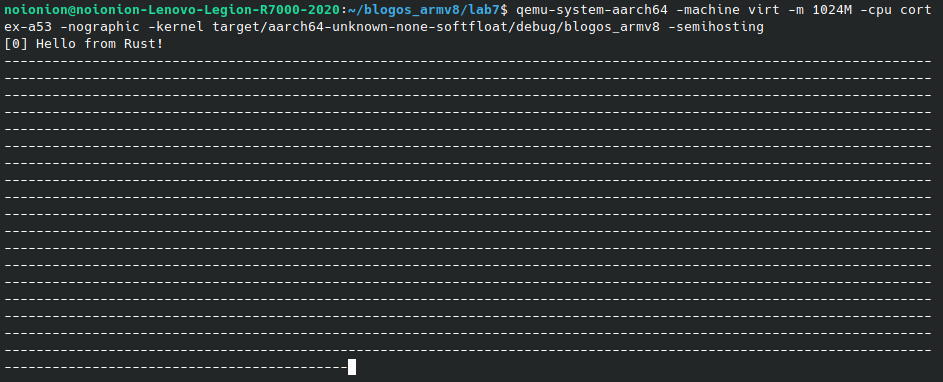
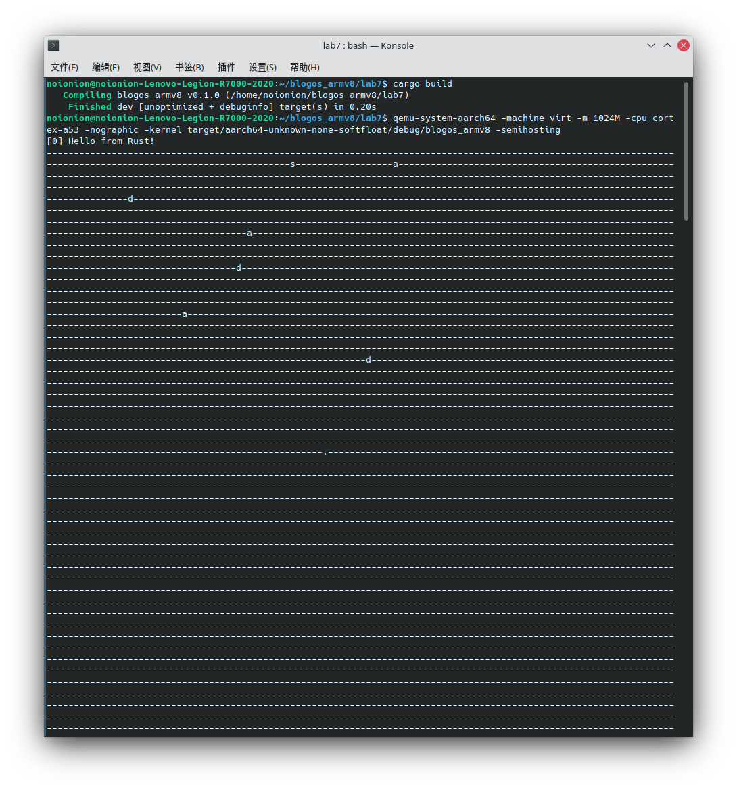

### 内核死锁发生原理、引发死锁及解决方法

#### 死锁原理

在单进程系统中，死锁更多的发生于进程对某一资源的竞争现象。例如我们在实验中中断等输出函数对`uart`硬件资源争夺。而多进程中的死锁更多的发生于两个不同进程发生了相互调用或资源竞争，互相等待对方结束进程的情况。这时候我们称系统产生了死锁或系统处于死锁状态。这些永远在等待状态的进程被称之为死锁进程。

死锁产生的原因一般可分为如下几种：

1. 竞争资源引起进程死锁

  当系统中供多个进程共享的资源如打印机、公用队列的等，其数目不足以满足诸进程的需要时，会引起诸进程对资源的竞争而产生死锁。

  首先要理解一个概念：**可剥夺资源**和**不可剥夺资源**

  > 系统中的资源可以分为两类，一类是可剥夺资源，是指某进程在获得这类资源后，该资源可以再被其他进程或系统剥夺。例如，优先权高的进程可以剥夺优先权低的进程的处理机。又如，内存区可由存储器管理程序，把一个进程从一个存储区移到另一个存储区，此即剥夺了该进程原来占有的存储区，甚至可将一进程从内存调到外存上，可见，CPU和主存均属于可剥夺性资源。
  >
  > 另一类资源是不可剥夺资源，当系统把这类资源分配给某进程后，再不能强行收回，只能在进程用完后自行释放，如磁带机、打印机等。

  * 竞争不可剥夺资源

    在系统中所配置的不可剥夺资源，由于它们的数量不能满足诸进程运行的需要，会使进程在运行过程中，因争夺这些资源而陷于僵局。例如，系统中只有一台打印机R1和一台磁带机R2，可供进程P1和P2共享。假定PI已占用了打印机R1，P2已占用了磁带机R2，若P2继续要求打印机R1，P2将阻塞；P1若又要求磁带机，P1也将阻塞。于是，在P1和P2之间就形成了僵局，两个进程都在等待对方释放自己所需要的资源，但是它们又都因不能继续获得自己所需要的资源而不能继续推进，从而也不能释放自己所占有的资源，以致进入死锁状态。

  * 竞争临时资源

    上面所说的打印机资源属于可顺序重复使用型资源，称为永久资源。还有一种所谓的临时资源，这是指由一个进程产生，被另一个进程使用，短时间后便无用的资源，故也称为消耗性资源，如硬件中断、信号、消息、缓冲区内的消息等，它也可能引起死锁。例如，SI，S2，S3是临时性资源，进程P1产生消息S1，又要求从P3接收消息S3；进程P3产生消息S3，又要求从进程P2处接收消息S2；进程P2产生消息S2，又要求从P1处接收产生的消息S1。如果消息通信按如下顺序进行：

    ```
    P1: ···Relese（S1）；Request（S3）； ···
    P2: ···Relese（S2）；Request（S1）； ···
    P3: ···Relese（S3）；Request（S2）； ···
    ```

    并不可能发生死锁。但若改成下述的运行顺序：

    ```
    P1: ···Request（S3）；Relese（S1）；···
    P2: ···Request（S1）；Relese（S2）； ···
    P3: ···Request（S2）；Relese（S3）； ···
    ```

2. 进程推进顺序不当引起死锁

  由于进程在运行中具有异步性特征，这可能使P1和P2两个进程按下述两种顺序向前推进。

  1. 进程推进顺序合法

  当进程P1和P2并发执行时，如果按照下述顺序推进：

  ```
  P1: Request（R1）; P2: Request（R2）; P1: Relese（R1）; P1: Relese（R2）;
  P2: Request（R2）; P2: Request（R1）; P2: Relese（R2）; P2: Relese（R1）;
  ```

  这两个进程便可顺利完成，这种不会引起进程死锁的推进顺序是合法的。

  2. 进程推进顺序非法

  若P1保持了资源R1,P2保持了资源R2，系统处于不安全状态，因为这两个进程再向前推进，便可能发生死锁。

  例如，当P1运行到P1：Request（R2）时，将因R2已被P2占用而阻塞；当P2运行到P2：Request（R1）时，也将因R1已被P1占用而阻塞，于是发生进程死锁。

#### 引发死锁

我们制作的 blogos 现在只是一个单进程系统。故我们没办法以进程推进顺序不当的方式引发死锁。鉴于我们已经实现了中断，而且系统也没有不可剥夺资源可供我们进程竞争，故引发死锁就只有唯一一种路径：**竞争临时资源**

uart 设备在系统中就属于这种可剥夺的临时资源。我们之前利用该硬件资源实现了屏幕输入与输出。

现在我们已经有了两个可用的中断：时钟中断和输入中断。这两个中断都使用了`print!`，即调用了 uart 硬件资源。然而这两个中断优先级相同，且我们并没有编写调度器，故这两个中断执行的是 FIFO 策略。故这两个中断不能互相的插入到对方进程中间，只会等到上一个中断处理完成才会进行。因此 uart 资源在中断执行期间被获取到释放是一个完整的过程，并不会被打断。

所以我们要在中断之外进行 uart 资源的占用，进而引发死锁。首先要明确的是，`print!`和`println!`宏中调用`uart_console::_print`函数，它使用自旋锁锁定一个全局的类`WRITER`:

```rust
#[doc(hidden)]
pub fn _print(args: fmt::Arguments) {
    use core::fmt::Write;
    WRITER.lock().write_fmt(args).unwrap();
}
```

它锁定了`WRITER`后，并在函数末尾隐式的解锁。但当我们在函数还未执行完之后异步的进入时钟中断或硬件中断之后，`WRITER`会处于一个未解锁的状态。而中断中的`print!`宏将尝试锁上`WRITER`类。

锁一个已经上锁的锁的锁显然是不可能的，而该步又是必要的。于是中断将一直卡死在尝试锁上`WRITER`类的状态上。此时资源的竞争则造成了系统的死锁状态。

了解了我们怎样去主动触发一个死锁的知识后，我们可以开始着手实现。首先是中断外要能成功占用 uart 资源，故我们选择在`src/main.rs`函数中调用`print!`；其次是增大`WRITER`类上锁时进入中断的概率，故我们选择将函数调用放在`loop`循环之中。由此在`src/main.rs`里`not_main`中修改：

```rust
// ...
#[no_mangle] // 不修改函数名
pub extern "C" fn not_main() {
    println!("[0] Hello from Rust!");
    interrupts::init_gicv2();
    loop {
        print!("-");
    };
}
```

正常流程应该是：

```
进程调用print!宏 -> print!宏锁定WRITER类 -> print!宏调用结束，解锁WRITER类
```

此时我们希望触发死锁的流程如下：

| 时间 | not_main | 中断 |
|-----|----------|-----|
| 0 | 调用`print!`宏 | |
| 1 | `print!`宏锁定`WRITER`类 | |
| 2 | | 中断发生，开始处理中断 |
| 3 | | 调用`print!`宏 |
| 4 | | `print!`宏尝试上锁`WRITER`类（已被上锁） |
| 5 | | `print!`宏尝试上锁`WRITER`类（已被上锁） |
| 6 | | `print!`宏尝试上锁`WRITER`类（已被上锁） |
| ... | | ... |
| 无法出现 | `print!`宏调用结束，解锁`WRITER`类 | |

由于`WRITER`已经被锁定，所以中断处理程序将会一直等待，直到它被释放。但这种情况永远不会发生，因为`not_main`函数只有在中断处理程序返回后才继续运行。因此，整个系统就会挂起。

编译并运行内核，可以看到：



此时系统产生第一次时间中断，而我们期望发生的事情发生了：**时间中断尝试打点，但是它无法进行这一步**。系统发生死锁了！

由于中断是异步发生的（硬件中断也可以实现相同的引发死锁操作），因此连字符的实际数量在两次运行之间会有所不同。这种不确定性使得与并发相关的错误很难调试。

#### 针对该情况的死锁预防

为了避免这种死锁，我们可以采取这样的方案：只要互斥锁`Mutex`是锁定的，就可以禁用中断。

当然，禁用中断不应该成为一种通用的解决方案。这一方案的弊端是，它会延长最坏情况下的中断等待时间，也就是系统对中断做出反应之前的时间。 因此，应该只在非常短的时间内禁用中断。

所以在这我更愿意理解为一个临时方法。当我们在调用`uart_console::_print`函数时（被`print!`宏和`println!`宏显式调用），我们将中断暂时禁用，以保证中断不会异步进行并抢占 uart 资源。只有当`WRITER`锁被释放我们才能重启中断。

修改`src/uart_console/mod.rs`中的`_print`函数：

```rust
#[doc(hidden)]
pub fn _print(args: fmt::Arguments) {
    use core::fmt::Write;
    unsafe {
            // 关闭daif类型的中断
            asm!("msr daifset, #0xf");
        }
    WRITER.lock().write_fmt(args).unwrap();
    unsafe {
        // 打开daif类型中断
        asm!("msr daifclr, #2")
    }
}
```

在 armv8-arch64 架构下，控制cpu是否响应 IRQ,FIQ,SERROR,DEBUG 中断，是由`PSTATUS`(daif寄存器)控制的。异常位中的掩码位(DAIF)允许对异常事件进行屏蔽。当位被设置时，不接受该异常。

* D 调试异常掩码
* A SError中断的处理状态掩码，例如，异步的外部中止。
* I IRQ 中断的处理状态掩码
* F FIQ 中断的处理状态掩码

实验指导书中是锁释放后只打开 i 类型的中断（`asm!("msr daifclr, #2");`），这里需要注意的是我们在gic中断初始化中也只启用了这个类型的中断：`src/interrupts.rs`中启用`timer`设备的时候（原则上讲应该是保存原先的中断启用状态，然后按位复原，但是以我的rust水平还不能让我干这件事）

保证了`WRITER`类使用之时不会异步的进入一个中断后，我们再次编译尝试：

```bash
cargo build
qemu-system-aarch64 -machine virt -m 1024M -cpu cortex-a53 -nographic -kernel target/aarch64-unknown-none-softfloat/debug/blogos_armv8 -semihosting
```



#### 常规死锁解决办法

这部分是我们暂时没做的。在单进程系统中，短暂的禁用中断是一个可行做法，但并不明智。死锁发生的情况是要同时满足互斥、请求与保持、不可剥夺、循环等待这四个条件，缺一不可。于是我们尝试破坏其中一个条件即可：

破坏互斥相对是比较不科学的做法。而一次性请求所有资源又会造成进程饥饿。循环等待是由于多进程间互相依赖才会产生。故单进程系统的死锁科学处理方法只剩下了破坏不可抢占条件这条路。

所以我们在请求锁定的资源时可以使用`unlock`来破坏已有的锁，从而获取到对应的资源。但是这种情况较为复杂，原先的请求资源行为会崩溃，这里并不具体实现（我也还说不清这属于是破坏互斥还是破坏不可抢占）。

多线程情况下进程可能是由于进程之间循环调用产生的，还可以摧毁其中一个进程来保证其他进程继续进行，即破坏循环等待条件。
