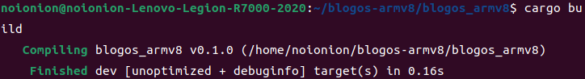
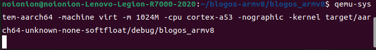
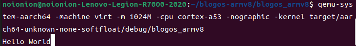

## 构建最小化内核

### 能跑起来的裸机程序尝试

试着创建一个`main`程序：新建项目

```bash
cargo new blogos_armv8 --bin --edition 2021
cd blogos_armv8
```

然后新建`src/main.rs`。此时`main`函数内容为空，因为我并不知道失去了标准库我还能在函数中使用什么代码。

```rust
#![no_std]

fn main() {}
```

然后`cargo build`进行构建，会产生两个报错：

```
error: language item required, but not found: `eh_personality`

error: `#[panic_handler]` function required, but not found
```

* `eh_personality`报错：

    > eh_personality 语义项(language item)用于标记函数：该函数在 堆栈展开(stack unwinding) 时被调用。当程序发生 panic 时，rust 会调用 堆栈展开 析构堆栈中的所有生存变量，达到释放内存的目的。但是这是一个复杂的过程，而且依赖于一些其他的库文件。所以我们只是简单的将其禁用：

    编辑`Cargo.toml`，在后边加入如下代码:

    ```toml
    # dev时禁用panic时栈展开
    [profile.dev]
    panic = "abort"

    # release时禁用panic时栈展开
    [profile.release]
    panic = "abort"
    ```

* `panic`报错：

    > 当程序出现异常时（程序并没有运行，但是这在编译阶段就会主动链接`panic`)，程序将会进入`panic`，此时需要调用相应函数。标准库有对应函数，但是由于我们使用了 `no_std` 属性，所以接下来我们需要自己实现一个函数。新建`src/panic.rs`

    ```cargo
    use core::panic::PanicInfo;

    #[panic_handler]
    fn on_panic(_info: &PanicInfo) -> ! {
        loop {}
    }
    ```

    然后在`main.rs`中引入`panic`

    ```rust
    mod panic;
    ```

    ~~由于程序 panic 后就应该结束，所以用 -> ! 表示该函数不会返回。由于目前的 OS 功能还很弱小，我们有希望系统保持开机状态，所以只能无限循环。~~

    这里之前找资料是这么说的。然后跟老师探讨时才发现错了。这里的`panic`里要用`loop`死循环处理属于是rust的特性。`panic`在rust中被规定必须是一个发散函数：

    发散函数（`diverging function`）是rust中的一个特性。发散函数不返回，它使用感叹号!作为返回类型表示。当程序调用发散函数时，该进程将直接进入崩溃（一般上来讲是发生程序员无法处理的错误时调用）。而如何在函数中表示其不返回？rust规定了以下三种情形：

    1. `panic!`以及基于它实现的各种函数/宏，比如`unimplemented!`、`unreachable!`；
    2. 无限循环`loop{}`；
    3. 进程退出函数`std::process::exit`以及类似的`libc`中的`exec`一类函数。

  由于我们不适用rust提供的标准库，故只能以死循环这样一种方式来编写我们的`panic`函数。而在我们的程序运行完后就结束了（并不保持开机），也不会调用panic。换言之，编写panic只是因为它是个必需的函数，但我们并不调用它。

--------

解决完如上几个报错后，再次`cargo build`，出现新的报错：

```
error: requires `start` lang_item
```

* `start`入口报错

    > 对于大多数语言，他们都使用了 运行时系统(runtime system) ，这导致 main 并不是他们执行的第一个函数。以 rust 语言为例：一个典型的 rust 程序会先链接标准库，然后运行 C runtime library 中的 crt0(C runtime zero) 设置 C 程序运行所需要的环境(比如：创建堆栈，设置寄存器参数等)。然后 C runtime 会调用 rust runtime 的 入口点(entry point) 。rust runtime 结束之后才会调用 main 。由于我们的程序无法访问 rust runtime 和 crt0 ，所以需要重写覆盖 crt0 入口点：

    新建`src/start.s`，告诉函数我们程序的进入入口在哪：

    ```assembly
    .globl _start
    .extern LD_STACK_PTR
    .section ".text.boot"

    _start:
            ldr     x30, =LD_STACK_PTR
            mov     sp, x30
            bl      not_main

    .equ PSCI_SYSTEM_OFF, 0x84000002
    .globl system_off
    system_off:
            ldr     x0, =PSCI_SYSTEM_OFF
            hvc     #0
    ```

    可以看到我们想告诉程序：我们这玩意的入口是`not_main`，程序要从`not_main`函数开始。然后修改`main.rs`，将主函数删除，替换成：

    ```rust
    #![no_main]

    #[no_mangle] // 不修改函数名
    pub extern "C" fn not_main() {}
    ```

    这里 `pub extern "C" fn not_main` 就是我们需要的 `start` 。 `#[no_mangle]` 属性用于防止改名称被混淆。

    由于 `start` 只能由操作系统或引导加载程序直接调用，不会被其他函数调用，所以不能够返回。如果需要离开该函数，应该使用 `exit` 系统调用。

    由于 start 函数无法返回或退出，自然也就不会调用 main 。所以将 main 函数删除，并且增加属性标签 `#![no_main]` 。

    然后修改程序启动例程：创建`aarch64-qemu.ld`，输入：

    ```ld
    ENTRY(_start)
    SECTIONS
    {
        . = 0x40080000;
        .text.boot : { *(.text.boot) }
        .text : { *(.text) }
        .data : { *(.data) }
        .rodata : { *(.rodata) }
        .bss : { *(.bss) }

        . = ALIGN(8);
        . = . + 0x4000;
        LD_STACK_PTR = .;
    }
    ```

    ENTRY(_start)中指明入口函数为_start函数，该函数在start.s中。

    通过 . = 0x40080000; 将程序安排在内存位置0x40080000开始的地方。

    链接脚本中的符号LD_STACK_PTR是全局符号，可以在程序中使用（如start.s中），这里定义的是栈底的位置。

--------

再次构建项目，却告诉我们汇编代码有问题：
```
error: unknown token in expression
```

* 汇编报错

    > 由于我们使用的是`arm`架构的汇编代码，自然用正常的编译方式这段汇编代码无法被正确解读。此时我们需要给`cargo`说明我们要编译的是给`arm`的代码：

    ```bash
    cargo build --target aarch64-unknown-none-softfloat
    ```

    为了方便，我们采用另一种方式：

    新建`.cargo/config.toml`，输入：

    ```toml
    [build]
    target = "aarch64-unknown-none-softfloat"
    rustflags = ["-C","link-arg=-Taarch64-qemu.ld", "-C", "target-cpu=cortex-a53", "-D", "warnings"]
    ```

    构建指令就仍然可以采用简短的`cargo build`

--------

再次尝试编译，出现如下错误：

```
error: linking with `rust-lld` failed: exit status: 1
```

* rust-lld报错：

    > 上节我们讲到需要构建原生目标三元组（而现有的三元组或多或少的都带有标准库），所以需要自己定义：

    新建`aarch64-unknown-none-softfloat.json`，配置目标平台相关参数，内容如下：

    ```json
    {
    "abi-blacklist": [
        "stdcall",
        "fastcall",
        "vectorcall",
        "thiscall",
        "win64",
        "sysv64"
    ],
    "arch": "aarch64",
    "data-layout": "e-m:e-i8:8:32-i16:16:32-i64:64-i128:128-n32:64-S128",
    "disable-redzone": true,
    "env": "",
    "executables": true,
    "features": "+strict-align,+neon,+fp-armv8",
    "is-builtin": false,
    "linker": "rust-lld",
    "linker-flavor": "ld.lld",
    "linker-is-gnu": true,
    "pre-link-args": {
        "ld.lld": ["-Taarch64-qemu.ld"]
    },
    "llvm-target": "aarch64-unknown-none",
    "max-atomic-width": 128,
    "os": "none",
    "panic-strategy": "abort",
    "relocation-model": "static",
    "target-c-int-width": "32",
    "target-endian": "little",
    "target-pointer-width": "64",
    "vendor": ""
    }
    ```

--------

最后进行一次构建：



使用如下命令运行裸机程序：

```bash
qemu-system-aarch64 -machine virt -m 1024M -cpu cortex-a53 -nographic -kernel target/aarch64-unknown-none-softfloat/debug/blogos_armv8
```



历经千辛万苦，我们终于成功构建了一个裸机程序！

--------

### 程序的开始："Hello World"

绝大部分程序员的第一个程序都是在屏幕上输出类似于`"Hello World“`这样的字样。不例外的，我们也让这个最小化内核出生后，向世界打招呼：

修改`main.rs`，将`not_main`函数修改成下面所示代码，并引用`core`库中的`ptr`模块：

```rust
use core::ptr;

#[no_mangle] // 不修改函数名
pub extern "C" fn not_main() {
    const UART0: *mut u8 = 0x0900_0000 as *mut u8;
    let out_str = b"Hello World";
    for byte in out_str {
        unsafe {
            ptr::write_volatile(UART0, *byte);
        }
    }
}
```

> 其中`UART0`是异步串行接口，在这个程序中相当于控制台的外设输入。具体在`lab5`还会在重新提到，这里不详细叙述。
>
> not_main函数通过`ptr::write_volatile`向串口输出字符，其原理也将在`lab2`中说明。

再次构建并运行，可以看到：



--------

### 完整代码

最终的代码可以查看[lab1 branch: https://github.com/2X-ercha/blogOS-armV8/tree/lab1](https://github.com/2X-ercha/blogOS-armV8/tree/lab1)。

下一节我们将使用`gdb`进行内核的远程调试：[gdb调试](../gdb/)
