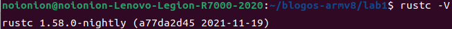

## 环境安装

### 安装rust

> 如若已经安装过`rust`，请使用`cargo install cargo-binutils rustfilt`命令补充安装相关工具

```bash
sudo apt-get install gcc 
curl --proto '=https' --tlsv1.2 -sSf https://sh.rustup.rs | sh
source $HOME/.cargo/env
cargo install cargo-binutils rustfilt
```

全新安装`rust`之后，鉴于实现操作系统时需要的各种并非出现在正式`rust`版本中的特性（如内联汇编语句`asm!()`)，以及实验要求的版本（这点在实验指导书中不是很明确的说明，`rust nightly`各版本代码差异极大，故在这里明确申明实验所用`rust`版本）

```bash
rustup install nightly-2021-11-20
rustup default nightly-2021-11-20
```

```bash
rustup default nightly-2021-11-20
```

此时输入`rustc -V`应该看到如下字样：



### 为rust增加armv8支持

`cargo` 在编译内核时，可以用过 `--target <target triple>` 支持不同的系统。**目标三元组 (target triple)** 包含：cpu 架构、供应商、操作系统和 ABI 。

由于我们在编写自己的操作系统，所以所有目前的目标三元组都不适用。幸运的是，rust 允许我们用 JSON 文件定义自己的目标三元组。

```bash
rustup target add aarch64-unknown-none-softfloat
```

自行定义的目标三元组内容也将在下一节说明，这里暂时略过。

### 安装QEMU模拟器

实验指导书中，希望我们参考教程去安装 qemu 。然后给出的教程却是如何在本地编译 qemu 。这并没有必要，ubuntu 的 apt 软件库之中已经提供了现成的模拟器软件。我们可以直接通过如下命令安装：

```bash
sudo apt-get install qemu qemu-system-arm
```

### 安装交叉编译工具链 (aarch64) 及其调试工具

交叉编译让我们能在`x86-64`架构中编译出能在`arm`架构执行的程序（两种架构底层的逻辑是不同的，以常规的编译方式，我们在`x86-64`下编译的程序无法在`arm`架构机器平台运行。这也是为什么在许多软件中，他会有多种统一系统的下载安装包。

```bash
wget https://developer.arm.com/-/media/Files/downloads/gnu-a/10.2-2020.11/binrel/gcc-arm-10.2-2020.11-x86_64-aarch64-none-elf.tar.xz
tar -xf gcc-arm-10*
sudo cp gcc-arm-10*/bin/* /usr/local/bin/
rm -rf gcc-arm-10*
```

第三条的`copy`指令是将我们交叉编译的工具链完整的放进我们的环境中。实验指导书的该行代码只拷贝了必要的编译工具 **（很不幸的是它唯独忘记了把gdb调试工具拷贝到其中）**。在这里我更推荐完整安装，毕竟编译工具的卸载也只是一行代码的事。

--------

好了，现在我们已经完成了前置的环境准备工作。可以开始下一节[构建最小化内核](../bm_exe/)