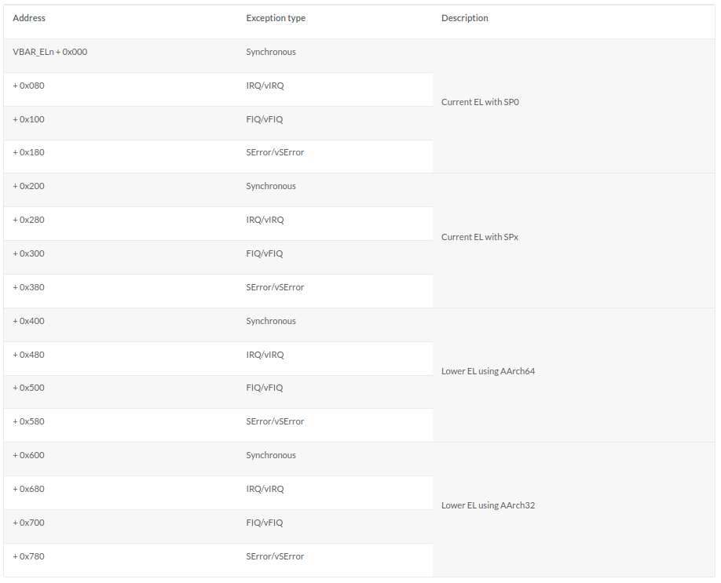

## ArmV8中断机制及异常回调

ARMv8 架构定义了两种执行状态(Execution States)，AArch64 和 AArch32。分别对应使用64位宽通用寄存器或32位宽通用寄存器的执行。


上图所示为AArch64中的异常级别(Exception levels)的组织。可见AArch64中共有4个异常级别，分别为EL0，EL1，EL2和EL3。在AArch64中，Interrupt是Exception的子类型，称为异常。 AArch64 中有四种类型的异常:

* Sync（Synchronous exceptions，同步异常），在执行时触发的异常，例如在尝试访问不存在的内存地址时。

* IRQ （Interrupt requests，中断请求），由外部设备产生的中断

* FIQ （Fast Interrupt Requests，快速中断请求），类似于IRQ，但具有更高的优先级，因此 FIQ 中断服务程序不能被其他 IRQ 或 FIQ 中断。

* SError （System Error，系统错误），用于外部数据中止的异步中断。

当异常发生时，处理器将执行与该异常对应的异常处理代码。在ARM架构中，这些异常处理代码将会被保存在内存的异常向量表中。每一个异常级别（EL0，EL1，EL2和EL3）都有其对应的异常向量表。需要注意的是，与x86等架构不同，该表包含的是要执行的指令，而不是函数地址 3 。

异常向量表的基地址由VBAR_ELn给出，然后每个表项都有一个从该基地址定义的偏移量。 每个表有16个表项，每个表项的大小为128（0x80）字节（32 条指令）。 该表实际上由4组，每组4个表项组成。 分别是：

* 发生于当前异常级别的异常且SPSel寄存器选择SP0 4 ， Sync、IRQ、FIQ、SError对应的4个异常处理。

* 发生于当前异常级别的异常且SPSel寄存器选择SPx 4 ， Sync、IRQ、FIQ、SError对应的4个异常处理。

* 发生于较低异常级别的异常且执行状态为AArch64， Sync、IRQ、FIQ、SError对应的4个异常处理。

* 发生于较低异常级别的异常且执行状态为AArch32， Sync、IRQ、FIQ、SError对应的4个异常处理。

### 异常向量表

阅读[AArch64 Exception and Interrupt Handling](https://developer.arm.com/documentation/100933/0100/AArch64-exception-vector-table)可得知以下异常向量表的地址定义：



故我们新建`src/exceptions.s`，并定义异常向量表如下：

```assembly
.section .text.exceptions_vector_table
// Export a symbol for the Rust code to use.
.globl exception_vector_table
exception_vector_table:

.org 0x0000
    EXCEPTION_VECTOR el1_sp0_sync

.org 0x0080
    EXCEPTION_VECTOR el1_sp0_irq

.org 0x0100
    EXCEPTION_VECTOR el1_sp0_fiq

.org 0x0180
    EXCEPTION_VECTOR el1_sp0_error

.org 0x0200
    EXCEPTION_VECTOR el1_sync

.org 0x0280
    EXCEPTION_VECTOR el1_irq

.org 0x0300
    EXCEPTION_VECTOR el1_fiq

.org 0x0380
    EXCEPTION_VECTOR el1_error

.org 0x0400
    EXCEPTION_VECTOR el0_sync

.org 0x0480
    EXCEPTION_VECTOR el0_irq

.org 0x0500
    EXCEPTION_VECTOR el0_fiq

.org 0x0580
    EXCEPTION_VECTOR el0_error

.org 0x0600
    EXCEPTION_VECTOR el0_32_sync

.org 0x0680
    EXCEPTION_VECTOR el0_32_irq

.org 0x0700
    EXCEPTION_VECTOR el0_32_fiq

.org 0x0780
    EXCEPTION_VECTOR el0_32_error

.org 0x0800
```

并定义异常向量表使用的`EXCEPTION_VECTOR`宏和宏中用的`.exit_exception`函数 ~~（这部分我也看不懂了）~~：

```assembly
.equ CONTEXT_SIZE, 264

.section .text.exceptions

.macro EXCEPTION_VECTOR handler

  sub sp, sp, #CONTEXT_SIZE

  // store general purpose registers
  stp x0, x1, [sp, #16 * 0]
  stp x2, x3, [sp, #16 * 1]
  stp x4, x5, [sp, #16 * 2]
  stp x6, x7, [sp, #16 * 3]
  stp x8, x9, [sp, #16 * 4]
  stp x10, x11, [sp, #16 * 5]
  stp x12, x13, [sp, #16 * 6]
  stp x14, x15, [sp, #16 * 7]
  stp x16, x17, [sp, #16 * 8]
  stp x18, x19, [sp, #16 * 9]
  stp x20, x21, [sp, #16 * 10]
  stp x22, x23, [sp, #16 * 11]
  stp x24, x25, [sp, #16 * 12]
  stp x26, x27, [sp, #16 * 13]
  stp x28, x29, [sp, #16 * 14]

  // store exception link register and saved processor state register
  mrs x0, elr_el1
  mrs x1, spsr_el1
  stp x0, x1, [sp, #16 * 15]

  // store link register which is x30
  str x30, [sp, #16 * 16]
  mov x0, sp

  // call exception handler
  bl \handler

  // exit exception
  b .exit_exception
.endm

.exit_exception:
  // restore link register
  ldr x30, [sp, #16 * 16]

  // restore exception link register and saved processor state register
  ldp x0, x1, [sp, #16 * 15]
  msr elr_el1, x0
  msr spsr_el1, x1

  // restore general purpose registers
  ldp x28, x29, [sp, #16 * 14]
  ldp x26, x27, [sp, #16 * 13]
  ldp x24, x25, [sp, #16 * 12]
  ldp x22, x23, [sp, #16 * 11]
  ldp x20, x21, [sp, #16 * 10]
  ldp x18, x19, [sp, #16 * 9]
  ldp x16, x17, [sp, #16 * 8]
  ldp x14, x15, [sp, #16 * 7]
  ldp x12, x13, [sp, #16 * 6]
  ldp x10, x11, [sp, #16 * 5]
  ldp x8, x9, [sp, #16 * 4]
  ldp x6, x7, [sp, #16 * 3]
  ldp x4, x5, [sp, #16 * 2]
  ldp x2, x3, [sp, #16 * 1]
  ldp x0, x1, [sp, #16 * 0]

  // restore stack pointer
  add sp, sp, #CONTEXT_SIZE
  eret
```

并处理链接脚本`aarch64-qemu.ld`，为在`src/exceptions.s`中所定义的`exceptions_vector_table`选择位置，同时满足其4K对齐要求。

```ld
.text :
{
  KEEP(*(.text.boot))
  *(.text.exceptions)
  . = ALIGN(4096); /* align for exceptions_vector_table*/
  *(.text.exceptions_vector_table)
  *(.text)
}
```

然后在`src/start.s`中载入异常向量表`exception_vector_table`

```assembly
.section ".text.boot"
_start:
    ldr     x30, =LD_STACK_PTR
    mov   sp, x30

    // Initialize exceptions
    ldr     x0, =exception_vector_table
    msr     vbar_el1, x0
    isb

_start_main:
    bl      not_main
```

### 异常处理回调函数

在`exceptions.s`中我们定义了`EXCEPTION_VECTOR`宏。在其中，每一类中断都对应一个处理函数，以`el1_sp0_sync`为例，其代码如下：

```rust
const EL1_SP0_SYNC: &'static str = "EL1_SP0_SYNC";

// 调用我们的print!宏打印异常信息，你也可以选择打印异常发生时所有寄存器的信息
fn catch(ctx: &mut ExceptionCtx, name: &str) {
    crate::print!(
        "\n  \
        {} @ 0x{:016x}\n\n ",
        name,
        ctx.elr_el1,
    );
}

#[no_mangle]
unsafe extern "C" fn el1_sp0_sync(ctx: &mut ExceptionCtx) {
    catch(ctx, EL1_SP0_SYNC);
}
```

此处还算不上处理，准确的说是定义了一个函数来作为异常发生时的应答，具体如何处理我们将在下一个实验中看到。

完整的各类处理应答如下：在`src/interrupts.rs`中新增如下代码：

```rust
global_asm!(include_str!("exceptions.s"));

#[repr(C)]
pub struct ExceptionCtx {
    regs: [u64; 30],
    elr_el1: u64,
    spsr_el1: u64,
    lr: u64,
}

// 输出字符定义，便于观察到是发生某类异常
const EL1_SP0_SYNC: &'static str = "EL1_SP0_SYNC";
const EL1_SP0_IRQ: &'static str = "EL1_SP0_IRQ";
const EL1_SP0_FIQ: &'static str = "EL1_SP0_FIQ";
const EL1_SP0_ERROR: &'static str = "EL1_SP0_ERROR";
const EL1_SYNC: &'static str = "EL1_SYNC";
const EL1_IRQ: &'static str = "EL1_IRQ";
const EL1_FIQ: &'static str = "EL1_FIQ";
const EL1_ERROR: &'static str = "EL1_ERROR";
const EL0_SYNC: &'static str = "EL0_SYNC";
const EL0_IRQ: &'static str = "EL0_IRQ";
const EL0_FIQ: &'static str = "EL0_FIQ";
const EL0_ERROR: &'static str = "EL0_ERROR";
const EL0_32_SYNC: &'static str = "EL0_32_SYNC";
const EL0_32_IRQ: &'static str = "EL0_32_IRQ";
const EL0_32_FIQ: &'static str = "EL0_32_FIQ";
const EL0_32_ERROR: &'static str = "EL0_32_ERROR";

// 调用print!宏打印异常信息，你也可以选择打印异常发生时所有寄存器的信息
fn catch(ctx: &mut ExceptionCtx, name: &str) {
    crate::print!(
        "\n  \
        {} @ 0x{:016x}\n",
        name, ctx.elr_el1,
    );
}

// 异常处理函数
#[no_mangle]
unsafe extern "C" fn el1_sp0_sync(ctx: &mut ExceptionCtx) {
    catch(ctx, EL1_SP0_SYNC);
}
#[no_mangle]
unsafe extern "C" fn el1_sp0_irq(ctx: &mut ExceptionCtx) {
    catch(ctx, EL1_SP0_IRQ);
}
#[no_mangle]
unsafe extern "C" fn el1_sp0_fiq(ctx: &mut ExceptionCtx) {
    catch(ctx, EL1_SP0_FIQ);
}
#[no_mangle]
unsafe extern "C" fn el1_sp0_error(ctx: &mut ExceptionCtx) {
    catch(ctx, EL1_SP0_ERROR);
}
#[no_mangle]
unsafe extern "C" fn el1_sync(ctx: &mut ExceptionCtx) {
    catch(ctx, EL1_SYNC);
}
#[no_mangle]
unsafe extern "C" fn el1_irq(ctx: &mut ExceptionCtx) {
    catch(ctx, EL1_IRQ);
}
#[no_mangle]
unsafe extern "C" fn el1_fiq(ctx: &mut ExceptionCtx) {
    catch(ctx, EL1_FIQ);
}
#[no_mangle]
unsafe extern "C" fn el1_error(ctx: &mut ExceptionCtx) {
    catch(ctx, EL1_ERROR);
}
#[no_mangle]
unsafe extern "C" fn el0_sync(ctx: &mut ExceptionCtx) {
    catch(ctx, EL0_SYNC);
}
#[no_mangle]
unsafe extern "C" fn el0_irq(ctx: &mut ExceptionCtx) {
    catch(ctx, EL0_IRQ);
}
#[no_mangle]
unsafe extern "C" fn el0_fiq(ctx: &mut ExceptionCtx) {
    catch(ctx, EL0_FIQ);
}
#[no_mangle]
unsafe extern "C" fn el0_error(ctx: &mut ExceptionCtx) {
    catch(ctx, EL0_ERROR);
}
#[no_mangle]
unsafe extern "C" fn el0_32_sync(ctx: &mut ExceptionCtx) {
    catch(ctx, EL0_32_SYNC);
}
#[no_mangle]
unsafe extern "C" fn el0_32_irq(ctx: &mut ExceptionCtx) {
    catch(ctx, EL0_32_IRQ);
}
#[no_mangle]
unsafe extern "C" fn el0_32_fiq(ctx: &mut ExceptionCtx) {
    catch(ctx, EL0_32_FIQ);
}
#[no_mangle]
unsafe extern "C" fn el0_32_error(ctx: &mut ExceptionCtx) {
    catch(ctx, EL0_32_ERROR);
}
```

至此，我们已经在EL1级别定义了完整的中断处理框架，可以开始处理实际的中断了。