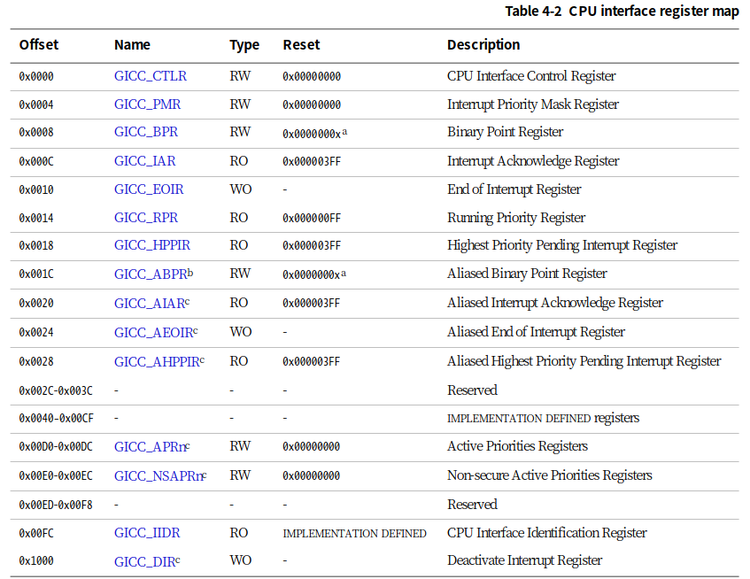

## GIC内核驱动编写及调用

在实现我们的中断控制器驱动前，首先还是要先了解GIC。由于实验中只需要实现GICv2，故在此只对GICv2进行介绍。

### 中断控制器GICv2

GIC 是联系外设中断和 CPU 的桥梁，也是各 CPU 之间中断互联的通道（也带有管理功能），它负责检测、管理、分发中断，可以做到：

1、使能或禁止中断；

2、把中断分组到Group0还是Group1（Group0作为安全模式使用连接FIQ ，Group1 作为非安全模式使用，连接IRQ ）；

3、多核系统中将中断分配到不同处理器上；

4、设置电平触发还是边沿触发方式（不等于外设的触发方式）；

5、虚拟化扩展。

  ARM CPU 对外的连接只有2 个中断： IRQ和FIQ ，相对应的处理模式分别是一般中断（IRQ ）处理模式和快速中断（FIQ ）处理模式。所以GIC 最后要把中断汇集成2 条线，与CPU 对接。

而在我们的实验中无需实现这么多功能。qemu模拟的virt机器作为单核系统，是不需要作过多的考虑的。而虚拟化扩展更非我们需要考虑实现的功能。

在gicv2中，gic由两个大模块`distributor`和`interface`组成：

1. distributor：主要负责中断源的管理、优先级、中断使能、中断屏蔽等，如下：

    * 中断分发，对于PPI,SGI是各个core独有的中断，不参与目的core的仲裁，SPI，是所有core共享的，根据配置决定中断发往的core。
          
    * 中断优先级的处理，将最高优先级中断发送给cpu interface。
        
    **寄存器使用 GICD_ 作为前缀。一个gic中，只有一个GICD。**  

2. cpu interface：要用于连接处理器，与处理器进行交互。将GICD发送的中断信息，通过IRQ,FIQ管脚，传输给core。
     
    **寄存器使用 GICC_ 作为前缀。每一个core，有一个cpu interface。**

3. 另外还有专门服务于虚拟中断的`virtual cpu interface`，这里并不考虑。

#### gic中断分发器(Distributor)

  分发器的主要的作用是检测各个中断源的状态，控制各个中断源的行为，分发各个中断源产生的中断事件到指定的一个或者多个CPU接口上。虽然分发器可以管理多个中断源，但是它总是把优先级最高的那个中断请求送往CPU接口。分发器对中断的控制包括：

* 打开或关闭每个中断。Distributor对中断的控制分成两个级别。一个是全局中断的控制`（GIC_DIST_CTRL）`。一旦关闭了全局的中断，那么任何的中断源产生的中断事件都不会被传递到 CPU interface。另外一个级别是对针对各个中断源进行控制`（GIC_DIST_ENABLE_CLEAR）`，关闭某一个中断源会导致该中断事件不会分发到 CPU interface，但不影响其他中断源产生中断事件的分发。

* 控制将当前优先级最高的中断事件分发到一个或者一组 `CPU interface`。当一个中断事件分发到多个 `CPU interface` 的时候，GIC 的内部逻辑应该保证只 `assert` 一个CPU。

* 优先级控制。

* `interrupt`属性设定。设置每个外设中断的触发方式：电平触发、边缘触发。

* `interrupt group`的设定。设置每个中断的 Group，其中 Group0 用于安全中断，支持 FIQ 和 IRQ，Group1 用于非安全中断，只支持 IRQ。

* 将SGI中断分发到目标CPU上。

* 每个中断的状态可见。

* 提供软件机制来设置和清除外设中断的pending状态。

#### gic中断接口(cpu interface)

CPU接口主要用于和CPU进行接口。主要功能包括：

* 打开或关闭 `CPU interface` 向连接的 `CPU assert` 中断事件。对于 ARM，CPU interface 和 CPU 之间的中断信号线是 nIRQCPU 和 nFIQCPU。如果关闭了中断，即便是 Distributor 分发了一个中断事件到 CPU interface，也不会 assert 指定的 nIRQ 或者 nFIQ 通知 Core。

* 中断的确认。Core 会向 `CPU interface` 应答中断（应答当前优先级最高的那个中断），中断一旦被应答，`Distributor` 就会把该中断的状态从 `pending` 修改成 `active` 或者 `pending and active`（这是和该中断源的信号有关，例如如果是电平中断并且保持了该 `asserted` 电平，那么就是 `pending and active`）。ack 了中断之后，CPU interface 就会 deassert `nIRQCPU` 和 `nFIQCPU` 信号线。

* 中断处理完毕的通知。当 `interrupt handler` 处理完了一个中断的时候，会向写 `CPU interface` 的寄存器通知 GIC CPU 已经处理完该中断。做这个动作一方面是通知 `Distributor` 将中断状态修改为 `deactive`，另外一方面，CPU interface 会 priority drop，从而允许其他的 pending 的中断向 CPU 提交。

* 为 CPU 设置中断优先级掩码。通过 `priority mask`，可以屏蔽掉一些优先级比较低的中断，这些中断不会通知到 CPU。

* 设置 CPU 的中断抢占（preemption）策略。

* 在多个中断事件同时到来的时候，选择一个优先级最高的通知 CPU。

关于`gicv2`就先介绍这么多。接下来我们开始一边实现我们需要实现的部分，一边继续介绍gicv2的细节。

### gicv2内核驱动

#### 寄存器定义

编写驱动首先需要对寄存器以一些常量化的方式表示，以便我们更好的调用。阅读设备树中关于gicv2部分的代码：

```vts
intc@8000000 {
        phandle = <0x8001>;
        reg = <0x00 0x8000000 0x00 0x10000 0x00 0x8010000 0x00 0x10000>;
        compatible = "arm,cortex-a15-gic";
        ranges;
        #size-cells = <0x02>;
        #address-cells = <0x02>;
        interrupt-controller;
        #interrupt-cells = <0x03>;

        v2m@8020000 {
                phandle = <0x8002>;
                reg = <0x00 0x8020000 0x00 0x1000>;
                msi-controller;
                compatible = "arm,gic-v2m-frame";
        };
};
```

其中`reg`一行约定了gic的寄存器在内存中的映射范围，并结合gicv2的文档[ARM Generic Interrupt Controller](https://www.kernel.org/doc/Documentation/devicetree/bindings/interrupt-controller/arm%2Cgic.txt)可知：

*   ```vts
    reg = <0x00 0x8000000 0x00 0x10000 0x00 0x8010000 0x00 0x10000>;
    ```

    约定：GICD寄存器映射到内存的位置为0x8000000，长度为0x10000， GICC寄存器映射到内存的位置为0x8010000，长度为0x10000

*   ```vts
    #interrupt-cells = <0x03>;
    ```

    结合文档可知：约定：第一个cell为中断类型，0表示SPI，1表示PPI；第二个cell为中断号，SPI范围为`[0-987]`，PPI为`[0-15]`；第三个cell为flags，其中`[3:0]`位表示触发类型，`4`表示高电平触发，`[15:8]`为PPI的cpu中断掩码，每1位对应一个cpu，为1表示该中断会连接到对应的cpu。

由此我们知道了gicv2的寄存器基址及其范围。阅读文档[ARM Generic Interrupt Controller Architecture version 2.0 - Architecture Specification](https://documentation-service.arm.com/static/5f8ff196f86e16515cdbf969?token=)，可知寄存器的相对基址的映射地址及其功能。

其中寄存器表如下：

* GICD部分寄存器（文档P75）：

    

    新建`src/interrupts.rs`文件，定义寄存器表如下：

    ```rust
    //GICD寄存器基址
    const GICD_BASE: u64 = 0x08000000;

    //GICD实验所需寄存器
    const GICD_CTLR: *mut u32 = (GICD_BASE + 0x0) as *mut u32;
    const GICD_ISENABLER: *mut u32 = (GICD_BASE + 0x0100) as *mut u32;
    // const GICD_ICENABLER: *mut u32 = (GICD_BASE + 0x0180) as *mut u32;（此寄存器用于中断disable，此实验并未使用该函数，故注释
    const GICD_ICPENDR: *mut u32 = (GICD_BASE + 0x0280) as *mut u32;
    const GICD_IPRIORITYR: *mut u32 = (GICD_BASE + 0x0400) as *mut u32;
    const GICD_ICFGR: *mut u32 = (GICD_BASE + 0x0c00) as *mut u32;

    //GICD常量值
    const GICD_CTLR_ENABLE: u32 = 1; // Enable GICD
    const GICD_CTLR_DISABLE: u32 = 0; // Disable GICD
    const GICD_ISENABLER_SIZE: u32 = 32;
    // const GICD_ICENABLER_SIZE: u32 = 32; 注释理由同上
    const GICD_ICPENDR_SIZE: u32 = 32;
    const GICD_IPRIORITY_SIZE: u32 = 4;
    const GICD_IPRIORITY_BITS: u32 = 8;
    const GICD_ICFGR_SIZE: u32 = 16;
    const GICD_ICFGR_BITS: u32 = 2;
    ```

* GICC部分寄存器（文档P76)

    

    继续编辑`src/interrupts.rs`文件，定义寄存器表如下：

    ```rust
    //GICC寄存器基址
    const GICD_BASE: u64 = 0x08010000;

    //GICC实验所需寄存器
    const GICC_CTLR: *mut u32 = (GICC_BASE + 0x0) as *mut u32;
    const GICC_PMR: *mut u32 = (GICC_BASE + 0x0004) as *mut u32;
    const GICC_BPR: *mut u32 = (GICC_BASE + 0x0008) as *mut u32;

    //GICC常量值
    const GICC_CTLR_ENABLE: u32 = 1;  // Enable GICC
    const GICC_CTLR_DISABLE: u32 = 0; // Disable GICC
    const GICC_PMR_PRIO_LOW: u32 = 0xff; // 优先级掩码寄存器，中断优先级过滤器，较高优先级对应较低优先级字段值。
    const GICC_BPR_NO_GROUP: u32 = 0x00; // 优先级分组是将GICC_BPR（Binary PointRegister）分为两个域，组优先级（group priority）和组内优先级（subpriority）。当决定抢占（Preemption）的时候，组优先级相同的中断被视为一样的，不考虑组内优先级。那就意味着在每个优先级组内只能有一个中断被激活。组优先级又被称为抢占级别（preemption level）。这里令其无组优先级。
    ```

#### GIC初始化

阅读文档(P77)的4.1.5节，可以看到如何对GIC的初始化启用。在这我们以一个对于rust而言不安全的方式（直接写入寄存器）来实现

```rust
use core::ptr;

pub fn init_gicv2() {
    // 初始化Gicv2的distributor和cpu interface
    // 禁用distributor和cpu interface后进行相应配置
    unsafe {
        ptr::write_volatile(GICD_CTLR, GICD_CTLR_DISABLE);
        ptr::write_volatile(GICC_CTLR, GICC_CTLR_DISABLE);
        ptr::write_volatile(GICC_PMR, GICC_PMR_PRIO_LOW);
        ptr::write_volatile(GICC_BPR, GICC_BPR_NO_GROUP);
    }

    // 启用distributor和cpu interface
    unsafe {
        ptr::write_volatile(GICD_CTLR, GICD_CTLR_ENABLE);
        ptr::write_volatile(GICC_CTLR, GICC_CTLR_ENABLE);
    }
}
```

先禁用gicv2再进行初始化配置，是为了避免上一次的关机未对gicv2禁用后对初始化造成的影响。当对寄存器做好配置后我们再启用它。

对`GICC_PMR`优先级掩码寄存器配置初始值`0xff`。通过该寄存器中的值，可以屏蔽低优先级中断，这样它们就永远不会被触发，我们设置`0xff`，由于值`0xff`对应于最低优先级，`0x00`对应于最高优先级，故为接受所有中断。而对`GICC_BPR`设置为0,则最高优先级的挂起中断将被传递给处理器，而不考虑组优先级。

#### GIC相关函数

对于某个中断号，我们本身需要有多种函数对其作相应的处理。继续向代码中添加如下内容：

```rust
// 使能中断号为interrupt的中断
pub fn enable(interrupt: u32) {
    unsafe {
        ptr::write_volatile(
            GICD_ISENABLER.add((interrupt / GICD_ISENABLER_SIZE) as usize),
            1 << (interrupt % GICD_ISENABLER_SIZE)
        );
    }
}

// 禁用中断号为interrupt的中断
/*
pub fn disable(interrupt: u32) {
    unsafe {
        ptr::write_volatile(
            GICD_ICENABLER.add((interrupt / GICD_ICENABLER_SIZE) as usize),
            1 << (interrupt % GICD_ICENABLER_SIZE)
        );
    }
}*/

// 清除中断号为interrupt的中断
pub fn clear(interrupt: u32) {
    unsafe {
        ptr::write_volatile(
            GICD_ICPENDR.add((interrupt / GICD_ICPENDR_SIZE) as usize),
            1 << (interrupt % GICD_ICPENDR_SIZE)
        );
    }
}

// 设置中断号为interrupt的中断的优先级为priority
pub fn set_priority(interrupt: u32, priority: u32) {
    let shift = (interrupt % GICD_IPRIORITY_SIZE) * GICD_IPRIORITY_BITS;
    unsafe {
        let addr: *mut u32 = GICD_IPRIORITYR.add((interrupt / GICD_IPRIORITY_SIZE) as usize);
        let mut value: u32 = ptr::read_volatile(addr);
        value &= !(0xff << shift);
        value |= priority << shift;
        ptr::write_volatile(addr, value);
    }
}

// 设置中断号为interrupt的中断的属性为config
pub fn set_config(interrupt: u32, config: u32) {
    let shift = (interrupt % GICD_ICFGR_SIZE) * GICD_ICFGR_BITS;
    unsafe {
        let addr: *mut u32 = GICD_ICFGR.add((interrupt / GICD_ICFGR_SIZE) as usize);
        let mut value: u32 = ptr::read_volatile(addr);
        value &= !(0x03 << shift);
        value |= config << shift;
        ptr::write_volatile(addr, value);
    }
}
```

由于`disable`函数在本实验从未使用过，未避免rust安全性报错/警告，这里选择注释。`enable`函数则参照文档P93中`4.3.5`节编写，`disable`函数参照`4.3.6`节，`clear`函数参照`4.3.8`节，`set_priority`函数参照`4.3.11`节，`set_config`函数参照`4.3.13`节。具体不在这里说明，建议参照文档阅读。

自此，我们已经基本完成了一个简略版的gicv2内核驱动，基本上可以满足实验的需求。