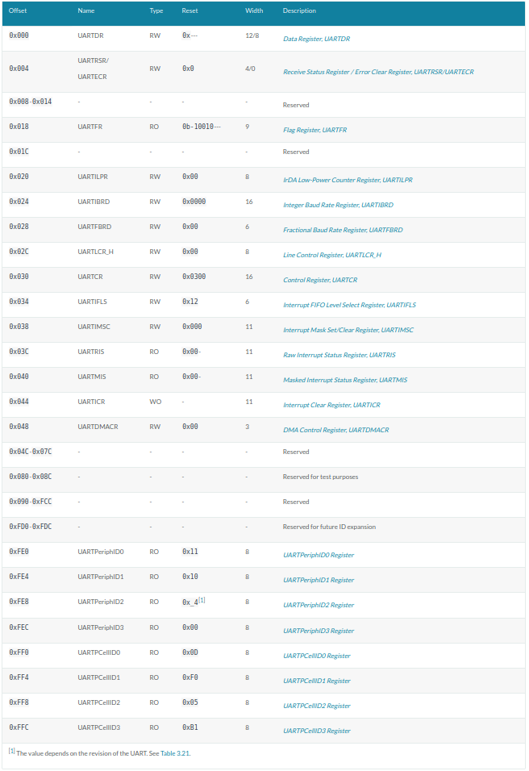

## pl011（UART）异步串行接口驱动编写

QEMU的virt机器默认没有键盘作为输入设备，但当我们执行QEMU使用`-nographic`参数（disable graphical output and redirect serial I/Os to console）时QEMU会将串口重定向到控制台，因此我们可以使用UART作为输入设备。

通用异步收发传输器（Universal Asynchronous Receiver/Transmitter)，通常称作UART。它将要传输的资料在串行通信与并行通信之间加以转换。作为把并行输入信号转成串行输出信号的芯片，UART通常被集成于其他通讯接口的连结上。

UART作为异步串口通信协议的一种，工作原理是将传输数据的每个字符一位接一位地传输。我们在控制台中的输入，也会被它传输到qemu中。

### tock-registers

在实验四中，针对GICD，GICC，TIMER等硬件我们定义了大量的常量和寄存器值，这在使用时过于繁琐也容易出错。于是我们决定使用`tock-registers`库。

`tock-registers`提供了一些接口用于更好的定义寄存器。官方说明如下：

> The crate provides three types for working with memory mapped registers: `ReadWrite`, `ReadOnly`, and `WriteOnly`, providing read-write, read-only, and write-only functionality, respectively. These types implement the `Readable`, `Writeable` and `ReadWriteable`  traits.
> 
> Defining the registers is done with the `register_structs` macro, which expects for each register an offset, a field name, and a type. Registers must be declared in increasing order of offsets and contiguously. Gaps when defining the registers must be explicitly annotated with an offset and gap identifier (by convention using a field named `_reservedN`), but without a type. The macro will then automatically take care of calculating the gap size and inserting a suitable filler struct. The end of the struct is marked with its size and the `@END` keyword, effectively pointing to the offset immediately past the list of registers.

翻译如下：

> tock-registers 提供了三种类型的内存映射寄存器：ReadWrite、ReadOnly和WriteOnly，分别提供读写、只读和只读功能。这些类型实现了可读、可写和可读写特性。
> 
> 寄存器的定义是通过`register_structs`宏完成的，该宏要求每个寄存器有一个偏移量、一个字段名和一个类型。寄存器必须按偏移量的递增顺序和连续顺序声明。定义寄存器时，必须使用偏移量和间隙标识符（按照惯例，使用名为_reservedN的字段）显式注释间隙，但不使用类型。然后，宏将自动计算间隙大小并插入合适的填充结构。结构的末尾用大小和@end关键字标记，有效地指向寄存器列表后面的偏移量。

根据官方的说明[tock_registers](https://docs.rs/tock-registers/latest/tock_registers/)作为一个示例，我们来实现`pl011`串口驱动。

阅读设备树关于`pl011`部分内容（实验二）：

```dts
pl011@9000000 {
    clock-names = "uartclk\0apb_pclk";
    clocks = <0x8000 0x8000>;
    interrupts = <0x00 0x01 0x04>;
    reg = <0x00 0x9000000 0x00 0x1000>;
    compatible = "arm,pl011\0arm,primecell";
};

chosen {
    stdout-path = "/pl011@9000000";
    kaslr-seed = <0xcbd0568d 0xb463306c>;
};
```

由上可以看出，virt机器包含有pl011的设备，该设备的寄存器在`0x9000000`开始处。pl011实际上是一个UART设备，即串口。可以看到virt选择使用pl011作为标准输出，这是因为与PC不同，大部分嵌入式系统默认情况下并不包含VGA设备。

而[uart寄存器表](https://developer.arm.com/documentation/ddi0183/g/programmers-model/summary-of-registers?lang=en)也列出了UART相关的寄存器如下图所示：



我们可以开始定义`pl011`驱动文件了。原则上来讲这部分内容应当定义在`src/uart_console.rs`中。但为了避免代码过长，我们选择重构`uart_console.rs`。

首先创建`src/uart_console`目录，并将原`uart_console.rs`更名为`mod.rs`，且置于`src/uart_console`目录下， 最后新建`src/uart_console/pl011.rs`文件。目录结构看起来像这样：

```
.
|____Cargo.toml
|____Cargo.lock
|____.cargo
| |____config.toml
|____aarch64-qemu.ld
|____.vscode
| |____launch.json
|____aarch64-unknown-none-softfloat.json
|____src
| |____panic.rs
| |____start.s
| |____interrupts.rs
| |____main.rs
| |____uart_console
| | |____mod.rs
| | |____pl011.rs
| |____exception.s
```

我们先需要在`Cargo.toml`中的`[dependencies]`节中加入依赖（这里实验指导书有误）：

```toml
[dependencies]
tock-registers = "0.7.0"
```

## 驱动编写

根据上述`tock_registers`官方说明和寄存器表，我们修改`src/uart_console/pl011.rs`如下：

```rust
use tock_registers::{registers::{ReadOnly, ReadWrite, WriteOnly}, register_bitfields, register_structs};

pub const PL011REGS: *mut PL011Regs = (0x0900_0000) as *mut PL011Regs;

register_bitfields![
    u32,

    pub UARTDR [
        DATA OFFSET(0) NUMBITS(8) []
    ],
    /// Flag Register
    pub UARTFR [
        /// Transmit FIFO full. The meaning of this bit depends on the
        /// state of the FEN bit in the UARTLCR_ LCRH Register. If the
        /// FIFO is disabled, this bit is set when the transmit
        /// holding register is full. If the FIFO is enabled, the TXFF
        /// bit is set when the transmit FIFO is full.
        TXFF OFFSET(6) NUMBITS(1) [],

        /// Receive FIFO empty. The meaning of this bit depends on the
        /// state of the FEN bit in the UARTLCR_H Register. If the
        /// FIFO is disabled, this bit is set when the receive holding
        /// register is empty. If the FIFO is enabled, the RXFE bit is
        /// set when the receive FIFO is empty.
        RXFE OFFSET(4) NUMBITS(1) []
    ],

    /// Integer Baud rate divisor
    pub UARTIBRD [
        /// Integer Baud rate divisor
        IBRD OFFSET(0) NUMBITS(16) []
    ],

    /// Fractional Baud rate divisor
    pub UARTFBRD [
        /// Fractional Baud rate divisor
        FBRD OFFSET(0) NUMBITS(6) []
    ],

    /// Line Control register
    pub UARTLCR_H [
        /// Parity enable. If this bit is set to 1, parity checking and generation
        /// is enabled, else parity is disabled and no parity bit added to the data frame.
        PEN OFFSET(1) NUMBITS(1) [
            Disabled = 0,
            Enabled = 1
        ],
        /// Two stop bits select. If this bit is set to 1, two stop bits are transmitted
        /// at the end of the frame.
        STP2 OFFSET(3) NUMBITS(1) [
            Stop1 = 0,
            Stop2 = 1
        ],
        /// Enable FIFOs.
        FEN OFFSET(4) NUMBITS(1) [
            Disabled = 0,
            Enabled = 1
        ],

        /// Word length. These bits indicate the number of data bits
        /// transmitted or received in a frame.
        WLEN OFFSET(5) NUMBITS(2) [
            FiveBit = 0b00,
            SixBit = 0b01,
            SevenBit = 0b10,
            EightBit = 0b11
        ]
    ],

    /// Control Register
    pub UARTCR [
        /// Receive enable. If this bit is set to 1, the receive
        /// section of the UART is enabled. Data reception occurs for
        /// UART signals. When the UART is disabled in the middle of
        /// reception, it completes the current character before
        /// stopping.
        RXE    OFFSET(9) NUMBITS(1) [
            Disabled = 0,
            Enabled = 1
        ],

        /// Transmit enable. If this bit is set to 1, the transmit
        /// section of the UART is enabled. Data transmission occurs
        /// for UART signals. When the UART is disabled in the middle
        /// of transmission, it completes the current character before
        /// stopping.
        TXE    OFFSET(8) NUMBITS(1) [
            Disabled = 0,
            Enabled = 1
        ],

        /// UART enable
        UARTEN OFFSET(0) NUMBITS(1) [
            /// If the UART is disabled in the middle of transmission
            /// or reception, it completes the current character
            /// before stopping.
            Disabled = 0,
            Enabled = 1
        ]
    ],

    pub UARTIMSC [
        RXIM OFFSET(4) NUMBITS(1) [
            Disabled = 0,
            Enabled = 1
        ]
    ],
    /// Interupt Clear Register
    pub UARTICR [
        /// Meta field for all pending interrupts
        ALL OFFSET(0) NUMBITS(11) [
            Clear = 0x7ff
        ]
    ]
];
```

这里对以上读写内容也不再细讲。只需要知道的是`pl011`的设备基址位于`0x0900_0000`(第二行代码），然后根据寄存器表定义我们需要的寄存器：

```rust
register_structs! {
    pub PL011Regs {
        (0x00 => pub dr: ReadWrite<u32, UARTDR::Register>),                   // 0x00
        (0x04 => __reserved_0),               // 0x04
        (0x18 => pub fr: ReadOnly<u32, UARTFR::Register>),      // 0x18
        (0x1c => __reserved_1),               // 0x1c
        (0x24 => pub ibrd: WriteOnly<u32, UARTIBRD::Register>), // 0x24
        (0x28 => pub fbrd: WriteOnly<u32, UARTFBRD::Register>), // 0x28
        (0x2C => pub lcr_h: WriteOnly<u32, UARTLCR_H::Register>), // 0x2C
        (0x30 => pub cr: WriteOnly<u32, UARTCR::Register>),     // 0x30
        (0x34 => __reserved_2),               // 0x34
        (0x38 => pub imsc: ReadWrite<u32, UARTIMSC::Register>), // 0x38
        (0x44 => pub icr: WriteOnly<u32, UARTICR::Register>),   // 0x44
        (0x48 => @END),
    }
}
```

这看起来好像比实验四中对应的寄存器描述部分要复杂，但如果你熟悉了之后，基本上可以依据技术参考手册中的寄存器描述无脑写了。（很多部分可以无脑抄）

然后我们在`src/uart_console/mod.rs`中引入`pl011.rs`，并修改`write_byte`。

我们在前面对输出是直接定义寄存器常量的

```rust
pub fn write_byte(&mut self, byte: u8) {
        const UART0: *mut u8 = 0x0900_0000 as *mut u8;
        unsafe {
            ptr::write_volatile(UART0, byte);
        }
    }
```

而现在我们已经定义好了`UART`的寄存器表，可以选择直接调用`pl011.rs`中定义的寄存器：

```rust
use tock_registers::{interfaces::Writeable};

pub mod pl011;
use pl011::*;

pub fn write_byte(&mut self, byte: u8) {
    // const UART0: *mut u8 = 0x0900_0000 as *mut u8;
    unsafe {
        // pl011 device registers
        let pl011r: &PL011Regs = &*PL011REGS;
        // ptr::write_volatile(UART0, byte);
        pl011r.dr.write(UARTDR::DATA.val(byte as u32));
    }
}
```

由于我们较为完整的定义好了`pl011`寄存器组，每次调用都需要一次初始化行为。故我们还需要为`Writer`结构实现构造函数，并修改`WRITER`宏的定义：

```rust
//往串口寄存器写入字节和字符串进行输出
impl Writer {
    // ...

    pub fn new() -> Writer{

        unsafe {
            // pl011 device registers
            let pl011r: &PL011Regs = &*PL011REGS;

            // 禁用pl011
            pl011r.cr.write(UARTCR::TXE::Disabled + UARTCR::RXE::Disabled + UARTCR::UARTEN::Disabled);
            // 清空中断状态
            pl011r.icr.write(UARTICR::ALL::Clear);
            // 设定中断mask，需要使能的中断
            pl011r.imsc.write(UARTIMSC::RXIM::Enabled);
            // IBRD = UART_CLK / (16 * BAUD_RATE)
            // FBRD = ROUND((64 * MOD(UART_CLK,(16 * BAUD_RATE))) / (16 * BAUD_RATE))
            // UART_CLK = 24M
            // BAUD_RATE = 115200
            pl011r.ibrd.write(UARTIBRD::IBRD.val(13));
            pl011r.fbrd.write(UARTFBRD::FBRD.val(1));
            // 8N1 FIFO enable
            pl011r.lcr_h.write(UARTLCR_H::WLEN::EightBit + UARTLCR_H::PEN::Disabled + UARTLCR_H::STP2::Stop1
                + UARTLCR_H::FEN::Enabled);
            // enable pl011
            pl011r.cr.write(UARTCR::UARTEN::Enabled + UARTCR::RXE::Enabled + UARTCR::TXE::Enabled);
        }

        Writer
    }
}

lazy_static! {
    pub static ref WRITER: Mutex<Writer> = Mutex::new(Writer::new());
}
```

最后是将无用的`ptr`引用去除

```diff
- use core::{fmt, ptr};
+ use core::fmt;
```

至此，我们完成了所有关于pl011（uart）串口驱动的编写。