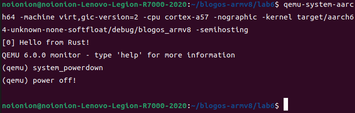

## 实现关机中断及其处理回调函数

关机中断仍然是`el1_irq`级别的中断，经过了上两个实验的回调函数编写，这部分可以说是熟门熟路了。

## 关机中断初始化

同前两个中断一样，我们还是需要对输入中断进行启用和配置。同时不一样的是，我们还要为`GPIO`的`GPIOIE`中断掩码寄存器作初始化。修改`src/interrupts.rs`，新增如下内容：

```rust
// GPIO中断号39
const GPIO_IRQ: u32 = 39;

pub fn init_gicv2() {
    // ...

    // 初始化GPIO中断
    set_config(GPIO_IRQ, ICFGR_LEVEL); //电平触发
    set_priority(GPIO_IRQ, 0); //优先级设定
    clear(GPIO_IRQ); //清除中断请求
    enable(GPIO_IRQ); //使能中断

    // 使能GPIO的poweroff key中断
    use crate::pl061::*;
    unsafe{
        let pl061r: &PL061Regs = &*PL061REGS;

        // 启用pl061 gpio中的3号线中断
        pl061r.ie.write(GPIOIE::IO3::Enabled);
    }
}
```

## 关机中断处理回调

然后对关机中断进行处理：修改我们的中断实际处理函数`handle_irq_lines`为如下，并新增输入中断处理函数`handle_gpio_irq`：

```rust
fn handle_irq_lines(ctx: &mut ExceptionCtx, _core_num: u32, irq_num: u32) {
    if irq_num == TIMER_IRQ {
        handle_timer_irq(ctx);
    } else if irq_num == UART0_IRQ {
        handle_uart0_rx_irq(ctx);
    } else if irq_num == GPIO_IRQ {
        handle_gpio_irq(ctx);
    } else{
        catch(ctx, EL1_IRQ);
    }
}

fn handle_gpio_irq(_ctx: &mut ExceptionCtx){
    use crate::pl061::*;
    crate::println!("power off!\n");
    unsafe {
        let pl061r: &PL061Regs = &*PL061REGS;

        // 清除中断信号 此时get到的应该是0x8
        pl061r.ic.set(pl061r.ie.get());
        // 关机
        asm!("mov w0, #0x18");
        asm!("hlt #0xF000");
    }
}
```

我们尝试关机，这里用到了`Arm`的`Semihosting`功能。

> Semihosting 的作用
> 
> Semihosting 能够让 bare-metal 的 ARM 设备通过拦截指定的 SVC 指令，在连操作系统都没有的环境中实现 POSIX 中的许多标准函数，比如 printf、scanf、open、read、write 等等。这些 IO 操作将被 Semihosting 协议转发到 Host 主机上，然后由主机代为执行。

构建并运行内核。为了启用`semihosting`功能，在QEMU执行时需要加入`-semihosting`参数

```bash
cargo build
qemu-system-aarch64 -machine virt -m 1024M -cpu cortex-a53 -nographic -kernel target/aarch64-unknown-none-softfloat/debug/blogos_armv8 -semihosting
```

在系统执行过程中，在窗口按键`ctrl + a, c`，后输入`system_powerdown`关机。（这里为了实验更加直观，我注释掉了时间中断的打点输出）



## 结语

这节的实验麻烦在于，第一次手写驱动。当我去研读文档，翻阅材料后编写完了这一段驱动代码后，再回头看驱动编写，确实也如实验指导书上一实验所说，“基本可以对着寄存器文档无脑写了”。完成这个驱动中间也经历了许多坎坷，例如`OFFSET`和`BITNUMS`的含义不清，没有连续定义等等产生的bug折磨了我一整天。

也算是，拨开云雾见天明吧。