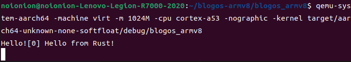

## print!和println!封装

上节说到，我们输出字符串，需要如下两步：

（1）创建Writer类型的实例

（2）调用实例的write_byte或write_string等函数。

为了方便在其他模块中调用，我们希望可以直接执行步骤（2）而不是首先执行上述步骤（1）再执行步骤（2）。

一般情况下可以通过将步骤（1）中的实例定义为static类型来实现

--------

### Write全局接口

我们尝试创建一个静态的WRITER变量：编辑`src/uart_console.rs`，新增：

```rust
pub static ref WRITER: Writer = Writer{};
```

我们尝试构建，却发生了错误。为了明白现在发生了什么，我们需要知道一点：一般的变量在运行时初始化，而静态变量在编译时初始化。Rust编译器规定了一个称为常量求值器`（const evaluator）`的组件，它应该在编译时处理这样的初始化工作。所以Rust暂不支持Writer这样类型的静态变量（编译时）初始化。

* 延迟初始化

    > 使用非常函数初始化静态变量是Rust程序员普遍遇到的问题。幸运的是，有一个叫做`lazy_static`的包提供了一个很棒的解决方案：它提供了名为`lazy_static!`的宏，定义了一个延迟初始化`（lazily initialized）`的静态变量；这个变量的值将**在第一次使用时计算，而非在编译时计算**。这时，变量的初始化过程将在运行时执行，任意的初始化代码——无论简单或复杂——都是能够使用的。

    现在我们引入`lazy_static`包：

    编辑`Cargo.toml`，向其中加入如下依赖：(在这里，由于程序不连接标准库，我们需要启用`spin_no_std`特性。)

    ```toml
    [dependencies.lazy_static]
    version = "1.0"
    features = ["spin_no_std"]
    ```

    然后将上述的静态变量`WRITER`的定义处套一层`lazy_static!`宏：

    ```rust
    use lazy_static::lazy_static;

    lazy_static! {
        pub static ref WRITER: Writer = Writer{};
    }
    ```

    再次编译可发现编译成功。然而，这个WRITER可能没有什么用途，因为它目前还是不可变变量`（immutable variable）`：这意味着我们无法向它写入数据，因为所有与写入数据相关的方法都需要实例的可变引用`&mut self`。
    
    一种解决方案是使用可变静态`（mutable static）`的变量，但所有对它的读写操作都被规定为不安全的（unsafe）操作，因为这很容易导致数据竞争或发生其它不好的事情——使用`static mut`极其不被赞成，甚至有一些提案认为应该将它删除。

* 自旋锁

    > 要定义同步的**内部可变**性，我们往往使用标准库提供的互斥锁类`Mutex`，它通过提供当资源被占用时将线程阻塞`（block）`的互斥条件`（mutual exclusion）`实现这一点；
    > 
    > 但我们初步的内核代码还没有线程和阻塞的概念，我们将不能使用这个类（而且我们也不能用标准库）。不过，我们还有一种较为基础的互斥锁实现方式——自旋锁`（spinlock）`。
    >
    > **自旋锁**并不会调用阻塞逻辑，而是**在一个小的无限循环中反复尝试获得这个锁**，也因此会一直占用CPU时间，直到互斥锁被它的占用者释放。

    简单的说，我们在从某个资源中读写数据知识，我们需要保证这个资源一直被我们所占用，**以免被其它的读写操作修改而导致结果错误，或引发一些其他的安全性问题**。（众所周知rust十分注重安全）

    向`Cargo.toml`加入如下依赖：
    ```toml
    [dependencies]
    spin = "0.9.2"
    ```

    然后再次修改我们的静态变量`WRITER`的定义：

    ```rust
    use lazy_static::lazy_static;
    use spin::Mutex;

    lazy_static! {
        pub static ref WRITER: Mutex<Writer> = Mutex::new(Writer { });
    }
    ```

    此时我们的`WRITER`才能可修改的全局晶态变量，为我们`print!`和`println`宏的实现做好了准备。

---------

### 实现 print! 宏

现在我们可以开始实现`print!`和`println!`了。我们继续向`src\uart_console.rs`中写入：

```rust
#[doc(hidden)]
pub fn _print(args: fmt::Arguments) {
    use core::fmt::Write;
    WRITER.lock().write_fmt(args).unwrap();
}

#[macro_export]
macro_rules! print {
    ($($arg:tt)*) => ($crate::uart_console::_print(format_args!($($arg)*)));
}

#[macro_export]
macro_rules! println {
    () => ($crate::print!("\n"));
    ($($arg:tt)*) => ($crate::print!("{}\n", format_args!($($arg)*)));
}
```

函数`_print`和`print!`宏是从标准库中得到的，而`println!`宏则作了一点修改。

我们在每个使用的`print!`宏前面添加了`$crate`变量。这样我们在只需要使用`println!`时，不必也编写代码导入`print!`宏。

1. 首先是关于`_print`函数：

    > 我们在静态变量`WRITER`中引入了自旋锁，而`_print`函数调用时，将通过`.lock`来完成对`WRITER`锁的占有。同时`_print`函数并调用它的write_fmt方法。这个方法是从名为`Write`的特性中获得的，所以我们需要导入这个特性。额外的`unwrap()`函数将在打印不成功的时候`panic`；但实际上我们的`write_str`总是返回Ok，这种情况不应该发生。
    > 
    > 考虑到这个函数是一个私有的实现细节，我们添加一个doc(hidden)属性，防止它在生成的文档中出现。（事实上这个实验也不会去生成文档）

2. 根据声明宏的定义（详见[上上节](../macro/)），我们为两个宏都添加了#[macro_export]属性，这样在包的其它地方也可以使用它们。
    
    > 需要注意的是，这将占用包的根命名空间`（root namespace）`，所以我们调用不能通过`use crate::uart_console::print`来导入，也不能直接通过`crate::uart_console::print!()`来调用它。
    
    故，我们应该使用`use crate::print`导入或直接通过`crate::print!()`进行调用。

--------

### 调用宏并测试

我们不再以额外文件`include!`的方式添加到`main.rs`，而是将其作为模块导入。

我们删除上一节中`main.rs`的测试代码，然后修改成如下（最终完整的`main.rs`文件）

```rust
// 不使用标准库
#![no_std]
// 不使用预定义入口点
#![no_main]
#![feature(global_asm)]

mod panic;
mod uart_console;

global_asm!(include_str!("start.s"));

#[no_mangle] // 不修改函数名
pub extern "C" fn not_main() {
    print!("Hello!");
    println!("[0] Hello from Rust!");
}
```

并在`src/uart_console.rs`开头导入`fmt`和`ptr`库

```rust
use core::{fmt, ptr};
```

然后编译运行：

```bash
cargo build
qemu-system-aarch64 -machine virt -m 1024M -cpu cortex-a53 -nographic -kernel target/aarch64-unknown-none-softfloat/debug/rui_armv8_os
```



--------

## 完整代码

最终的代码可以查看lab2 breach: https://github.com/2X-ercha/blogOS-armV8/tree/lab2。