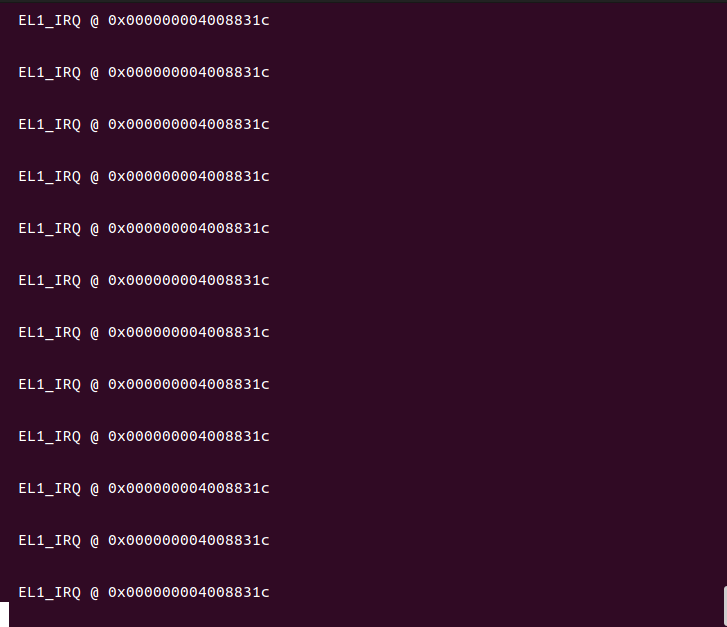

## Timer计时器的原理和时钟中断服务实现

### Timer计时器介绍

任何AArch64 CPU都应该有一个通用计时器，但是有些板也可以包含外部计时器。arm架构对应的timer文档在[https://developer.arm.com/documentation/102379/0000/What-is-the-Generic-Timer-?lang=en](https://developer.arm.com/documentation/102379/0000/What-is-the-Generic-Timer-?lang=en)，里面介绍了timer通用计时器的一些说明。参照设备树中timer的部分

```dts
timer {
        interrupts = <0x01 0x0d 0x104 0x01 0x0e 0x104 0x01 0x0b 0x104 0x01 0x0a 0x104>;
        always-on;
        compatible = "arm,armv8-timer\0arm,armv7-timer";
};
```

设备树中说明，timer设备中包括4个中断。以第二个中断的参数`0x01 0x0e 0x104`为例，其指明该中断为PPI类型的中断，中断号14， 路由到第一个cpu，且高电平触发。但注意到PPI的起始中断号为16，所以实际上该中断在GICv2中的中断号应为`16 + 14 = 30`。我们将基于此，实现计时器触发中断。

这里也简单介绍一下`timer`的计时器：

在ARM体系结构中，处理器内部有通用计时器，通用计时器包含一组比较器，用来与系统计数器进行比较，一旦通用计时器的值小于等于系统计数器时便会产生时钟中断。timer寄存器如下：

* CNTPCT_EL0- physical counter value register

* CNTP_CTL_EL0- physical counter control register

* CNTP_TVAL_EL0 and CNTP_CVAL_EL0- two threshold value registers, 定时寄存器（TVAL） and 比较寄存器（CVAL）

* CNTFRQ_EL0- counter frequency register

1. 对于系统计数器来说，可以通过读取控制寄存器CNTPCT_EL0来获得当前的系统计数值（无论处于哪个异常级别）

2. **比较寄存器有64位，如果设置了之后，当系统计数器达到或超过了这个值之后（CVAL<系统计数器），就会触发定时器中断。**

3. **定时寄存器有32位，如果设置了之后，会将比较寄存器设置成当前系统计数器加上设置的定时寄存器的值（CVAL=系统计数器+TVAL）**

4. 每组定时器都还有一个控制寄存器（CTL），其只有最低三位有意义，其它的60位全是保留的，设置成0.

> * 0:ENABLE：是否打开定时器，使其工作；
>   
> * 1:IMASK：中断掩码，如果设置成1，则即使定时器是工作的，仍然不会发出中断；
>  
> * 2:ISTATUS：如果定时器打开的话，且满足了触发条件，则将这一位设置成1。

原理上讲，我们只需要在时钟开始时对定时器进行一次初始化，而在计时时间到达时，系统将会触发一次时钟中断，从而引发一次`el1_irq`异常。之后相对应的异常回调函数将调用输出，打印异常。

### 时钟中断服务

了解了原理之后，我们尝试实现时钟中断。我们首先需要在系统启动时进行初始化，启用定时器并启用时钟中断（设置控制寄存器），然后设置定时。我们在`src/interrupts.rs`文件的`init_gicv2`初始化函数中新增如下内容：

```rust
// 电平触发
const ICFGR_LEVEL: u32 = 0;
// 时钟中断号30
const TIMER_IRQ: u32 = 30;

pub fn init_gicv2() {
    // ...

    set_config(TIMER_IRQ, ICFGR_LEVEL); //电平触发
    set_priority(TIMER_IRQ, 0); //优先级设定
    clear(TIMER_IRQ); //清除中断请求
    enable(TIMER_IRQ); //使能中断

    //配置timer
    unsafe {
        asm!("mrs x1, CNTFRQ_EL0"); //读取系统频率
        asm!("msr CNTP_TVAL_EL0, x1");  //设置定时寄存器
        asm!("mov x0, 1");
        asm!("msr CNTP_CTL_EL0, x0"); //设置控制器，令其enable=1, imask=0, istatus= 0
        asm!("msr daifclr, #2");
    }
}
```

在这里我们将这个函数设置成为了低电平触发，所以我们在主函数调用时需要将系统转入低电平的运行状态。编辑`src/main.rs`，结果如下：

```rust
// 不使用标准库
#![no_std]
// 不使用预定义入口点
#![no_main]
#![feature(global_asm)]
#![feature(asm)] // 为interrupts.rs和main.rs调用内联汇编

mod panic;
mod uart_console;
mod interrupts; // 引入中断

global_asm!(include_str!("start.s"));

#[no_mangle] // 不修改函数名
pub extern "C" fn not_main() {
    println!("[0] Hello from Rust!");
    interrupts::init_gicv2(); //初始化gicv2和timer
    unsafe {
        loop { // 轮询系统中断
            asm!("wfi"); // 将系统置于低电平运行状态
        }
    }
}
```

然后编译运行：

```bash
cargo build
qemu-system-aarch64 -machine virt -m 1024M -cpu cortex-a53 -nographic -kernel target/aarch64-unknown-none-softfloat/debug/blogos_armv8
```

运行结果如下：



系统不断打印触发了`el1_irq`信息。这里的循环是因为我们只接收了中断，而中断引发的异常并未被处理，寄存器未被复位所以不断触发异常。

## 结语

实验指导书在这里很多东西都没讲清楚，很多资料只能自己去看文档，做翻译。同时实验指导书也缺乏了timer如何验证中断产生（本身没有写需要拉低电平引发中断的操作），导致我们去翻阅了实验的原型（leos）才发现了这一点。

leos能参考的部分似乎到这里就结束了，之后的实验作完整性阐述难度也更大了。