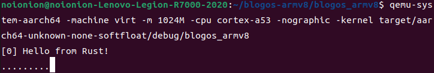

## 时钟中断回调函数实现

在上一个实验中，我们实现了时间中断，但没有对引发的时间中断做处理回调。我们先扫尾，然后再来处理输入中断。

我们知道，时间中断后引发的异常是`el1_irq`类中断，所以我们所需修改的是`src/interrupts.rs`文件中关于`el1_irq`的回调函数。原函数如下：

```rust
#[no_mangle]
unsafe extern "C" fn el1_irq(ctx: &mut ExceptionCtx) {
    catch(ctx, EL1_IRQ);
}
```

我们需要的是实现对时钟的中断进行准确的分辨，所以我们需要在该异常被处发后，读取中断号并作相应处理。

当定时器触发时间中断后，中断控制器的`GICC_IAR`寄存器将被写入中断号`30`。结合上节的GICC寄存器表，我们在GICC寄存器处新增两个需要调用的寄存器地址映射，定义如下：

```diff
  //GICC寄存器基址
  const GICD_BASE: u64 = 0x08010000;

  //GICC实验所需寄存器
  const GICC_CTLR: *mut u32 = (GICC_BASE + 0x0) as *mut u32;
  const GICC_PMR: *mut u32 = (GICC_BASE + 0x0004) as *mut u32;
  const GICC_BPR: *mut u32 = (GICC_BASE + 0x0008) as *mut u32;
+ const GICC_IAR: *mut u32 = (GICC_BASE + 0x0c) as *mut u32;
+ const GICC_EOIR: *mut u32 = (GICC_BASE + 0x10) as *mut u32;
```

* `GICC_IAR`寄存器中存放的是当前的中断号。例如当时间中断发生时，寄存器中将写入中断号`30`（前5位）和对应的内核编号（后三位），我们可以通过读取该寄存器中的值来做中断号识别

* `GICC_EOIR`寄存器则用于标记某一中断被完成，即中断处理结束的信号。这个信号告诉控制器：中断已经被处理，并且系统已经准备好接收下一个中断。 

基于以上，我们可以根据[GIC手册](https://documentation-service.arm.com/static/5f8ff196f86e16515cdbf969?token=)修改`el1_irq`处理回调函数，修改如下：

```rust
#[no_mangle]
unsafe extern "C" fn el1_irq(ctx: &mut ExceptionCtx) {
    // 中断确认（读取中断号和中断对应核）
    let value: u32 = ptr::read_volatile(GICC_IAR);
    let irq_num: u32 = value & 0x1ff;
    let core_num: u32 = value & 0xe00;

    // 实际处理中断
    handle_irq_lines(ctx, core_num, irq_num);

    // 中断完成标记信号
    ptr::write_volatile(GICC_EOIR, core_num | irq_num);

    // 清除相应中断位
    clear(irq_num);
}
```

并编写中断处理函数`handle_irq_lines`：

```rust
fn handle_irq_lines(ctx: &mut ExceptionCtx, _core_num: u32, irq_num: u32) {
    if irq_num == TIMER_IRQ {       // 确认时间中断
        handle_timer_irq(ctx);
    } else{
        catch(ctx, EL1_IRQ);
    }
}

// 时间中断对应处理函数
fn handle_timer_irq(_ctx: &mut ExceptionCtx){

    crate::print!(".");     //我们令其每发生一次中断就打点一次，更直观的体现出发生时间中断

    // 重置定时器，使其再过2秒产生一次中断
    unsafe {
        asm!("mrs x1, CNTFRQ_EL0");
        asm!("add x1, x1, x1");
        asm!("msr CNTP_TVAL_EL0, x1");
    }
}
```

大致的流程还是很好理解的，我们编译运行后看看效果：

```bash
cargo build
qemu-system-aarch64 -machine virt -m 1024M -cpu cortex-a53 -nographic -kernel target/aarch64-unknown-none-softfloat/debug/blogos_armv8
```

效果如下（每两秒将会有一次打点）：



循环打点一方面是定时的功劳，另一方面是主函数中循环将系统置于低电平状态后的结果。每一次的中断处理后，系统将重新回到高电平运行状态。如果我们不采用`loop`轮询，将只会发生一次打点，此后及时重新到达定时器时间并发送了时钟中断，GIC也不会进行处理（因为设置的是低电平触发）。

下一节我们将正式开始关于串口的驱动编写，完成这个实验的主要部分：实现输入功能。
