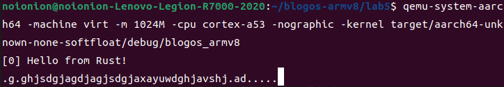

## 串口输入中断处理回调

第一节我们讲到了如何去实现timer中断的处理回调。而输入中断也是`el1_irq`一类的中断。回到我们修改/新增的几个函数，我们将中断实际处理部分针对输入中断做一些判断和处理即可。

### 输入中断初始化

同时钟中断一样，我们还是需要对输入中断进行启用和配置。修改`src/interrupts.rs`，新增如下内容：

```rust
// 串口输入中断号33
const UART0_IRQ: u32 = 33;

pub fn init_gicv2() {
    // ...

    // 初始化UART0 中断
    // interrupts = <0x00 0x01 0x04>; SPI, 0x01, level
    set_config(UART0_IRQ, ICFGR_LEVEL); //电平触发
    set_priority(UART0_IRQ, 0); //优先级设定
    clear(UART0_IRQ); //清除中断请求
    enable(UART0_IRQ); //使能中断
}
```

### 输入中断处理回调

然后对UART的数据接收中断进行处理：修改我们的中断实际处理函数`handle_irq_lines`为如下，并新增输入中断处理函数`handle_uart0_rx_irq`：

```rust
fn handle_irq_lines(ctx: &mut ExceptionCtx, _core_num: u32, irq_num: u32) {
    if irq_num == TIMER_IRQ {
        handle_timer_irq(ctx);
    } else if irq_num == UART0_IRQ {
        handle_uart0_rx_irq(ctx);
    } else{
        catch(ctx, EL1_IRQ);
    }
}

use tock_registers::interfaces::Readable;

fn handle_uart0_rx_irq(_ctx: &mut ExceptionCtx){
    use crate::uart_console::pl011::*;
    unsafe{
        // pl011 device registers
        let pl011r: &PL011Regs = &*PL011REGS;

        let mut flag = pl011r.fr.read(UARTFR::RXFE);
        while flag != 1 {
            let value = pl011r.dr.read(UARTDR::DATA);

            crate::print!("{}", value as u8 as char);
            flag = pl011r.fr.read(UARTFR::RXFE);
        }
    }
}
```

当我们输入一个字符后，uart产生一次输入中断，而输入中断处理函数则将我们输入的字符从寄存器中取出并调用`print!`宏打印出来。

由此我们完成了输入中断的处理。我们进行代码的构建并运行：

```bash
cargo build
qemu-system-aarch64 -machine virt -m 1024M -cpu cortex-a53 -nographic -kernel target/aarch64-unknown-none-softfloat/debug/blogos_armv8
```

当我们随意的在控制台中敲击字符，除去时钟中断的打点输出，我们将看到我们输入的字符。此时说明我们的输入中断是成功运作的。



## 结语

这节的实验并不算复杂，主要是对`pl011`驱动编写的地方很多不明所以，需要去翻阅官方的实例。而相比起来，中断回调的编写算是了解知识点就能编写的简单题了。