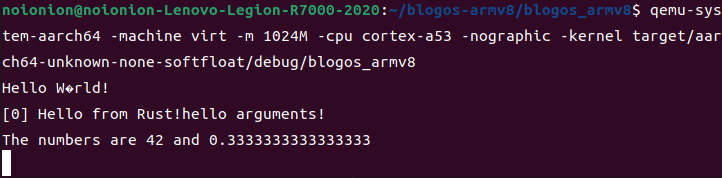

## Write 实例实现和测试

### 实例实现

回顾实验一的`main.rs`代码，看看我们是如何实现输出`Hello World`的

```rust
const UART0: *mut u8 = 0x0900_0000 as *mut u8;
let out_str = b"Hello World";
for byte in out_str {
    unsafe {
        ptr::write_volatile(UART0, *byte);
    }
}
```

我们向`UART`串口循环写入我们想输出的字符。于是我们定义一个`Write`结构来实现输出单个字符和字符串：

新建`src/uart_console.rs`，定义如下结构：

```rust
//嵌入式系统使用串口，而不是vga，直接输出，没有颜色控制，不记录列号，也没有frame buffer，所以采用空结构
pub struct Writer;

//往串口寄存器写入字节和字符串进行输出
impl Writer {
    pub fn write_byte(&mut self, byte: u8) {
        const UART0: *mut u8 = 0x0900_0000 as *mut u8;
        unsafe {
            ptr::write_volatile(UART0, byte);
        }
    }

    pub fn write_string(&mut self, s: &str) {
        for byte in s.chars() {
            self.write_byte(byte as u8)
        }
    }
}
```

与`main.rs`中的输出进行对比，便显得很容易理解。我们为`Write`结构实现`core::fmt::Write trait(特性)`。继续向文件中加入如下代码：

```rust
impl core::fmt::Write for Writer {
  fn write_str(&mut self, s: &str) -> fmt::Result {
      self.write_string(s);
      Ok(())
  }
}
```

由于我们实现了 write_str ，核心库会帮我们自动实现 write_fmt 。如果你想进一步了解这部分内容，可以阅读 rust 官方文档中 [core::fmt::Write 部分](https://doc.rust-lang.org/core/fmt/trait.Write.html) 和 [rust 官方教程中 Traits](https://doc.rust-lang.org/book/ch10-02-traits.html) 部分。

基于Rust的`core::fmt`实现格式化控制，可以使我们方便地打印不同类型的变量。实现`core::fmt::Write`后，我们就可以使用Rust内置的格式化宏`write!`和`writeln!`，这使你瞬间具有其他语言运行时所提供的格式化控制能力。

--------

### 测试

向`main.rs`中加入测试函数，并修改`not_main`函数

```rust
#[no_mangle] // 不修改函数名
pub extern "C" fn not_main() {
    print_something();
}

//以下是测试代码部分
include!("uart_console.rs");
//引用Writer需要的控件
use core::fmt;
use core::fmt::Write;

//测试函数
pub fn print_something() {
    let mut writer = Writer{};

    // 测试Writer我们实现的两个函数
    writer.write_byte(b'H');
    writer.write_string("ello ");
    writer.write_string("Wörld!\n");
    writer.write_string("[0] Hello from Rust!");

    // 验证实现core::fmt::Write自动实现的方法
    let display: fmt::Arguments = format_args!("hello arguments!\n");
    writer.write_fmt(display).unwrap();
    // 使用write!宏进行格式化输出
    write!(writer, "The numbers are {} and {} \n", 42, 1.0/3.0).unwrap();
}
```

`cargo build`后并运行进行测试

```bash
cargo build
qemu-system-aarch64 -machine virt -m 1024M -cpu cortex-a53 -nographic -kernel target/aarch64-unknown-none-softfloat/debug/blogos_armv8
```



--------

现在我们已经可以采用print_something函数通过串口输出字符了。但为了输出，我们需要两个步骤：

（1）创建Writer类型的实例

（2）调用实例的write_byte或write_string等函数。

为了方便在其他模块中调用，我们希望可以直接执行步骤（2）而不是首先执行上述步骤（1）再执行步骤（2）。

所以接下来我们将实现`print!`和`println!`宏，更方便的进行输出调用。下一节：[print!和println!封装](../print!/)